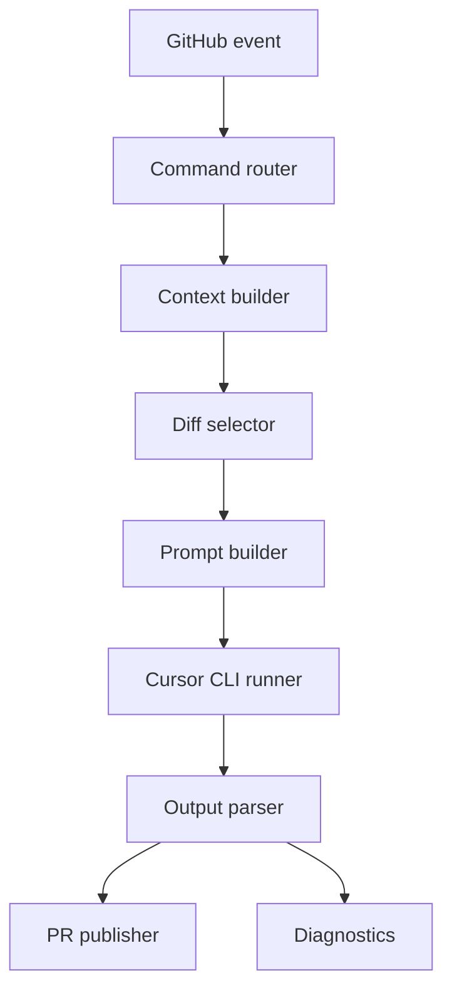

# PR-Agent Engine Mapping

## Purpose

This document maps PR-Agent's core engine ideas into a clean-room, Cursor-native implementation plan for `cursor-review-action`.

We do not copy PR-Agent source code, prompt text, templates, tests, or implementation details. We only use public product behavior and documented architecture as design input, then implement our own Cursor-based engine.

## Scope

This mapping focuses on the core engine:

- Commands: `review`, `ask`, `improve`, `describe`
- Context construction
- Diff selection and compression
- Prompt templates
- Structured output parsing
- Publishing strategy
- Configuration
- Quality and regression testing

Out of scope for this phase:

- GitHub App server
- GitLab, Bitbucket, Azure DevOps, Gitea support
- Full inline suggestion implementation
- Ticketing system integration
- Auto-fix or auto-commit flows

## Parity Goal

The goal is not to copy PR-Agent code. The goal is to reach **behavioral parity** for the core PR-Agent engine features while keeping this project Cursor-native.

Behavioral parity means:

- For the same PR and the same command intent, the action collects an equivalent class of context.
- It applies equivalent diff-selection decisions, especially for large PRs.
- It uses command-specific prompts and output contracts instead of a generic prompt.
- It produces useful, structured, reviewer-facing or author-facing output according to the command.
- It has observable diagnostics when behavior differs or coverage is partial.
- It is protected by fixture regression tests so future changes do not silently degrade behavior.

This document must be treated as a living parity plan. Any discovered PR-Agent behavior that is relevant to the core engine should be added here before implementation.

## Parity Levels

Use these levels to avoid vague claims such as "perfectly compatible":

- **P0: Required parity**  
  Must be implemented before claiming this action has a PR-Agent-inspired engine.
- **P1: Strong parity**  
  Important for quality and should be implemented before a stable `v1`.
- **P2: Optional parity**  
  Valuable but can wait until the core flow is stable.
- **Out of scope**  
  Not planned for this clean-room action, usually because it requires a GitHub App, server, or multi-platform provider layer.

## Evidence Gates

No capability should be marked complete without evidence:

1. **Documented behavior**: The PR-Agent behavior is described from public docs or high-level observation.
2. **Clean-room design**: Our implementation design is written in our own terms, without copied code or prompt text.
3. **Fixture coverage**: At least one fixture PR exercises the behavior.
4. **Regression assertion**: The fixture has an automated check for context, prompt shape, parser behavior, or rendered output.
5. **Runtime diagnostic**: The action output shows enough information to debug the behavior in a real PR.

If any gate is missing, the capability is not done.

## High-Level Engine Flow



## Capability Matrix

### Command Semantics

PR-Agent behavior to learn from:

- `/review` is for reviewer-facing feedback: risks, tests, security, review effort, split suggestions.
- `/ask` answers a specific question about the PR and has no memory between questions.
- `/improve` generates actionable improvement suggestions and is more author-facing.
- `/describe` creates or updates PR description, title, type, walkthrough, labels, and optional diagrams.

Cursor-native implementation:

- Use `/cursor-review`, `/cursor-ask`, `/cursor-improve`, `/cursor-describe`.
- Give each command a dedicated prompt template and JSON schema.
- Keep `/cursor-review` enabled by default.
- Keep other commands disabled by default until validated.

Implementation target:

- `scripts/engine/commands.py`
- `scripts/engine/prompts/review.md`
- `scripts/engine/prompts/ask.md`
- `scripts/engine/prompts/improve.md`
- `scripts/engine/prompts/describe.md`

Parity level:

- `/cursor-review`: P0
- `/cursor-ask`: P1
- `/cursor-improve`: P1
- `/cursor-describe`: P1
- Inline line-level `/ask`: P2
- Ask on images: Out of scope for the first Cursor-native engine

Validation checklist:

- A slash command maps to exactly one command handler.
- Unknown commands fail with a clear message.
- Disabled commands fail safely and do not call Cursor.
- User-provided command text is passed as prompt context, never shell.

### Context Construction

PR-Agent behavior to learn from:

- Uses PR title, branch name, original description, commit messages, diff patches, and modified file contents.
- Can use generated metadata from earlier commands, such as description and file walkthrough.
- Supports local/global metadata and extra instructions.

Current action:

- Uses mostly `git diff`, `git diff --stat`, and slash command text.

Cursor-native implementation:

- Add structured context object:
  - PR number
  - PR title
  - PR body
  - source branch
  - base branch
  - commit messages
  - changed files
  - diff stat
  - user slash command text
  - existing Cursor bot comments
  - repo config
- Keep context builder independent from GitHub provider details so future GitHub API enrichment is easy.

Implementation target:

- `scripts/engine/context.py`
- Add new action inputs for `pr-title`, `pr-body`, `base-ref`, `head-ref`, and optional `commit-messages`.

Parity level:

- PR title/body/branch metadata: P0
- commit messages: P0
- changed files and diff stat: P0
- existing bot comments: P1
- generated describe metadata reused by later commands: P1
- ticket context: P2
- image context: Out of scope

Validation checklist:

- Context object is serialized into a debug artifact or diagnostics section.
- Missing metadata degrades gracefully.
- PR comment prompt is preserved exactly as user intent text.
- Existing bot comments are included only when explicitly enabled.

### Diff Selection and Compression

PR-Agent behavior to learn from:

- Excludes binary and non-code files.
- Prioritizes files by repo languages.
- Expands surrounding context for small PRs.
- For large PRs, prioritizes additions over deletions.
- Removes deletion-only hunks.
- Fits patches into a token budget.
- Uses dynamic/asymmetric context around code changes.

Current action:

- Gets a unified diff and truncates by `max_diff_bytes`.

Cursor-native implementation:

- Replace raw truncation with a staged selector:
  1. Classify changed files.
  2. Exclude binary/generated/vendor files by default.
  3. Prioritize code, tests, config, security-sensitive files.
  4. Preserve file path, hunk header, additions, and minimal surrounding context.
  5. Drop deletion-only hunks first for large diffs.
  6. Record reviewed files and skipped files.
  7. Emit explicit coverage diagnostics.
- Keep byte budget first; add token estimation later.

Implementation target:

- `scripts/engine/diff_selector.py`
- Diagnostics fields:
  - `reviewed_files`
  - `skipped_files`
  - `diff_bytes_before`
  - `diff_bytes_after`
  - `selection_reason`

Parity level:

- binary/generated file exclusion: P0
- additions prioritized over deletions: P0
- deletion-only hunks removed first for large PRs: P0
- reviewed/skipped file diagnostics: P0
- language-aware file ordering: P1
- dynamic/asymmetric hunk context: P1
- token-aware fitting: P1
- multi-call chunking for huge PRs: P2

Validation checklist:

- Large diff fixture proves the selector does not blindly cut in the middle without diagnostics.
- Deleted-only changes are summarized instead of consuming most of the budget.
- Skipped files are shown in the PR comment diagnostics.
- Test and config files are not accidentally deprioritized below unrelated generated files.

### Prompt Templates

PR-Agent behavior to learn from:

- Uses command-specific prompts and tool-specific configuration.
- Allows extra instructions.
- Encourages different personas for reviewer vs author.

Current action:

- One Python function changes one task sentence based on command.

Cursor-native implementation:

- Move prompt text into dedicated templates.
- Template inputs:
  - command
  - repo config
  - user prompt
  - PR metadata
  - diff selection summary
  - selected diff
  - output schema
- Make templates stable and testable.

Command-specific prompt intent:

- `review`: actionable findings focused on bugs, security, tests, regression risk.
- `ask`: answer only the user's question, cite PR evidence, do not general-review.
- `improve`: prioritized suggestions, avoid duplicates, include before/after guidance when safe.
- `describe`: PR type, summary, walkthrough, risk, test plan, optional changelog style.

Implementation target:

- `scripts/engine/prompts/`
- `scripts/engine/prompt_builder.py`

Parity level:

- command-specific template files: P0
- extra instructions per command: P0
- output schema embedded in prompt: P0
- repo best-practices file injection: P1
- generated PR walkthrough injection: P1
- prompt self-debug / relevant config display: P1

Validation checklist:

- A fixture can snapshot the rendered prompt without calling Cursor.
- Each command prompt has a different task, schema, and comment style.
- User prompt cannot override security rules or execution constraints.

### Structured Output

PR-Agent behavior to learn from:

- Uses structured output for reliable rendering and downstream actions.
- Converts structured result into markdown, labels, suggestions, or description updates.

Current action:

- Requests `<review_markdown>` and `<findings_json>`, then falls back to raw markdown.

Cursor-native implementation:

- Define schemas per command.
- Common finding fields:
  - `severity`
  - `file`
  - `line`
  - `title`
  - `body`
  - `confidence`
  - `suggestion`
  - `evidence`
- Parser flow:
  1. Extract JSON block.
  2. Validate required fields.
  3. Retry once with a repair prompt if invalid.
  4. Fall back to markdown with diagnostics if still invalid.

Implementation target:

- `scripts/engine/parser.py`
- `scripts/engine/schemas.py`

Parity level:

- review findings schema: P0
- parser fallback to markdown: P0
- one repair retry on invalid JSON: P1
- command-specific schemas for ask/improve/describe: P1
- score/rank fields for improve suggestions: P1
- strict failure mode for CI gating: P2

Validation checklist:

- Invalid JSON fixture triggers repair or downgrade.
- Missing required fields are surfaced in diagnostics.
- Empty findings are treated as valid, not failure.
- Parser never drops raw model output without preserving diagnostics.

### Finding Grounding and Anchor Validation

PR-Agent behavior to learn from:

- Useful review findings are tied to concrete changed code, relevant files, and reviewable evidence.
- Inline comments and suggestions require reliable file and line anchors.
- Large PR handling must make it clear whether a finding came from reviewed context or unreviewed/skipped context.

Current action:

- Allows the model to emit `file`, `line`, and `evidence`, but does not validate that the anchor exists in the selected diff.

Cursor-native implementation:

- Build a diff index from the selected diff before calling Cursor:
  - file path
  - file status
  - hunk headers
  - new-side changed line numbers
  - old-side line numbers for deletions
  - renamed file metadata when available
- Validate parsed findings after model output:
  - `anchored`: file and line match selected diff.
  - `file_only`: file is in selected diff but line is missing or not changed.
  - `unanchored`: finding has useful content but cannot be tied to a selected file.
  - `invalid`: file or line conflicts with selected diff.
- Render invalid anchors as diagnostics, not as high-confidence review findings.
- Keep summary-comment publishing as P0; do not require inline comments for grounding.
- Prepare an inline-ready anchor object, but only use it when reporter support exists.

Implementation target:

- `scripts/engine/diff_index.py`
- `scripts/engine/grounding.py`
- `docs/finding-grounding.md`

Parity level:

- diff line index: P0
- parsed finding anchor validation: P0
- invalid-anchor downgrade diagnostics: P0
- inline-ready anchor object: P1
- cross-file evidence graph: P2
- inline publishing from anchors: P2

Validation checklist:

- Fixture with valid changed-line finding remains anchored.
- Fixture with unchanged-line finding is downgraded to `file_only` or diagnostics.
- Fixture with nonexistent file is marked invalid.
- Deleted-only diff can represent old-side evidence without claiming a new-line anchor.
- Large PR skipped file cannot produce an anchored finding unless the file was selected.
- CI gating never treats invalid anchors as blocking findings.

### Publishing Strategy

PR-Agent behavior to learn from:

- Supports persistent comments.
- Can update previous comments.
- Can publish labels.
- Can publish inline suggestions or table suggestions.
- `/describe` may update PR body while preserving user content.

Current action:

- Updates one persistent `## Cursor Review` PR comment.

Cursor-native implementation:

- Use command-specific markers:
  - `<!-- cursor-review-action:review -->`
  - `<!-- cursor-review-action:ask -->`
  - `<!-- cursor-review-action:improve -->`
  - `<!-- cursor-review-action:describe -->`
- Default publisher:
  - summary comment only
  - persistent update enabled
- Later publisher:
  - inline annotations
  - labels
  - PR description update for describe

Implementation target:

- `scripts/engine/render.py`
- `scripts/engine/publish_contract.md`
- Keep GitHub API write logic in `action.yml` or move it to a small GitHub script helper later.

Parity level:

- persistent summary comment: P0
- command-specific markers: P0
- final update message link: P1
- describe as PR body update with user-content preservation: P1
- labels: P2
- inline suggestions: P2

Validation checklist:

- `/cursor-review` does not overwrite `/cursor-ask`.
- Re-running the same command updates the previous command-specific comment.
- Comment body includes diagnostics and coverage summary.
- If GitHub comment fails, the Actions summary still contains the result.

### Configuration Model

PR-Agent behavior to learn from:

- Supports local and global config.
- Tool-specific config sections.
- Allows inline command options.
- Can output relevant configuration for debugging.

Current action:

- Supports `.cursor-review.yml` and workflow inputs.

Cursor-native implementation:

- Keep `.cursor-review.yml`.
- Add command sections:

```yaml
model: auto
language: zh-CN

review:
  max_findings: 5
  require_tests: true
  require_security: true

ask:
  cite_evidence: true

improve:
  max_suggestions: 5
  focus_only_on_problems: true

describe:
  update_pr_body: false
  include_test_plan: true
```

- Configuration precedence:

```text
slash command args > slash command prompt > repo config > workflow inputs > action defaults
```

Implementation target:

- `scripts/engine/config.py`

Parity level:

- repo local config: P0
- workflow inputs override defaults: P0
- command-specific config sections: P0
- slash command arguments: P1
- global org config repo: P2
- wiki config: Out of scope

Validation checklist:

- Diagnostics show effective config when enabled.
- Config precedence is deterministic and tested.
- Unknown config keys warn but do not break the run.
- Invalid config values fail clearly or fall back safely.

### Command Arguments and Online Overrides

PR-Agent behavior to learn from:

- Commands can include inline configuration overrides, such as changing tool-specific settings for one run.
- Extra instructions can be provided per command without changing repository config.

Current action:

- Supports slash command text as extra prompt.
- Does not yet parse structured command arguments.

Cursor-native implementation:

- Support a small, explicit argument grammar:

```text
/cursor-review --focus=security,tests --max-findings=3
/cursor-improve --max-suggestions=5
/cursor-describe --comment-only
```

- Only allow known keys.
- Treat free text after arguments as user prompt.
- Never pass arguments to shell.

Implementation target:

- `scripts/engine/command_args.py`
- `tests/fixtures/command_args/`

Parity level:

- extra free-text instructions: P0
- safe known-argument parsing: P1
- arbitrary PR-Agent-style nested config args: P2

Validation checklist:

- Unknown args warn and are ignored or fail clearly based on strictness config.
- Command arguments override repo config for that run only.
- Free-text prompt is preserved after argument parsing.
- Malicious shell-looking args are treated as text only.

### Cursor Runner Contract

PR-Agent behavior to learn from:

- Separates tool logic from the AI provider layer.
- Supports model configuration and provider-level failures.

Current action:

- Calls Cursor CLI directly from the main script.

Cursor-native implementation:

- Define a runner contract:
  - input: prompt, model, timeout, retry mode, command name
  - output: raw text, exit code, stderr, duration, retry count
- Keep Cursor CLI as the first runner.
- Leave room for Cursor SDK runner later without changing engine layers.

Implementation target:

- `scripts/engine/runner.py`
- `scripts/engine/cursor_cli_runner.py`

Parity level:

- Cursor CLI runner contract: P0
- timeout and retry diagnostics: P0
- model fallback: P1
- Cursor SDK runner: P2

Validation checklist:

- Runner failures are classified as install/auth/model/runtime/output failures.
- Requested model is always visible in diagnostics.
- Empty output is handled separately from non-zero exit.
- Future runner changes do not affect command/context/diff modules.

### Run State, Idempotency, and Concurrency

PR-Agent behavior to learn from:

- Persistent comments and repeated runs should not create uncontrolled comment spam.
- Online commands should be repeatable and predictable.

Current action:

- Updates one persistent review comment.

Cursor-native implementation:

- Treat every run as idempotent per command and PR.
- Use command-specific markers.
- Include run metadata in diagnostics.
- Avoid concurrent comments overwriting each other when multiple commands run close together.

Implementation target:

- `scripts/engine/run_state.py`
- command-specific marker contract in `scripts/engine/publish_contract.md`

Parity level:

- command-specific persistent marker: P0
- run metadata diagnostics: P0
- stale run detection: P1
- concurrency lock or optimistic update guard: P2

Validation checklist:

- Running `/cursor-review` twice updates only review comment.
- Running `/cursor-ask` does not overwrite review comment.
- Rerun diagnostics show event name, sha, and command.
- Old workflow reruns are documented as stale behavior.

### Trigger Trust and Permission Model

PR-Agent behavior to learn from:

- Mature PR bots usually run behind an app or service identity with explicit permission boundaries.
- Slash commands, automatic PR events, fork PRs, and external contributors have different trust levels.
- Users need predictable behavior when a trigger is ignored, skipped, or reduced to a safe mode.

Current action:

- Relies on GitHub Actions events and tokens.
- Mentions fork PR and unauthorized comments as risks, but does not define a policy matrix.

Cursor-native implementation:

- Define a trigger policy matrix:
  - `pull_request` from same repository.
  - `pull_request` from fork.
  - `issue_comment` on PR by trusted maintainer/member.
  - `issue_comment` on PR by first-time or external contributor.
  - `workflow_dispatch` by maintainer.
  - rerun of older workflow.
- Define trust levels:
  - `trusted`
  - `limited`
  - `untrusted`
  - `unknown`
- P0 default policy:
  - same-repo PR can run automatic review when secrets are available.
  - fork PR without secrets is skipped or dry-run explained.
  - issue-comment commands require trusted author association by default.
  - untrusted comment text is never executed and cannot change shell commands.
  - `pull_request_target` is not used in the default workflow.
- P1:
  - configurable allowlist of author associations.
  - safe dry-run for untrusted triggers.
  - per-command trigger policy.
- P2:
  - GitHub App identity.
  - organization-level policy.
  - maintainer approval queue for external triggers.

Implementation target:

- `scripts/engine/trust_policy.py`
- `docs/trigger-policy.md`
- `tests/fixtures/triggers/`

Parity level:

- trigger policy matrix: P0
- author association gating for comment commands: P0
- fork PR safe skip/explain path: P0
- no default `pull_request_target`: P0
- configurable trusted associations: P1
- per-command trigger policy: P1
- GitHub App identity: P2

Validation checklist:

- Fork PR without secrets produces a clear skip diagnostic.
- External issue comment cannot trigger a Cursor call by default.
- Same-repo PR keeps existing automatic review behavior.
- `workflow_dispatch` includes actor and trigger diagnostics.
- Rerun diagnostics show that workflow/config may be stale.
- Default examples do not require `pull_request_target`.

### Cost, Budget, and Rate Controls

PR-Agent behavior to learn from:

- Large PRs may be chunked or limited by max calls.
- Suggestion generation can be bounded by thresholds and chunk counts.

Current action:

- Uses one Cursor call and `max_diff_bytes`.

Cursor-native implementation:

- Keep default one-call behavior for predictable cost.
- Add explicit budgets:
  - `max_diff_bytes`
  - `max_files`
  - `max_hunks`
  - `max_cursor_calls`
  - `timeout_seconds`
- Any skipped content must be visible in diagnostics.

Implementation target:

- `scripts/engine/budget.py`

Parity level:

- explicit diff budget: P0
- file/hunk budget: P1
- max Cursor calls: P1
- chunked multi-call pipeline: P2

Validation checklist:

- Huge PR fixture stays within budget.
- User sees why content was skipped.
- Default settings never unexpectedly make multiple Cursor calls.
- Optional multi-call behavior is opt-in.

### PR-Agent Comparison Protocol

PR-Agent behavior to learn from:

- Mature quality comes from repeated real-world usage and output comparison, not only architecture.

Current action:

- No systematic comparison protocol.

Cursor-native implementation:

- Maintain a comparison suite using public or synthetic PRs.
- For each PR, record:
  - PR-Agent command output behavior at a high level
  - Cursor-native command output behavior
  - missing context
  - false positives
  - false negatives
  - user-facing usefulness
- Do not copy PR-Agent prompt or source output verbatim into golden files.

Implementation target:

- `docs/parity-reports/`
- `tests/fixtures/`

Parity level:

- comparison protocol: P1
- public parity scorecard: P2

Validation checklist:

- At least 5 sample PRs before `v0.5`.
- At least 10-20 sample PRs before `v1`.
- Every comparison gap becomes backlog or explicit non-goal.

### Traceability and Parity Scorecard

PR-Agent behavior to learn from:

- Mature systems make behavior traceable through configuration, diagnostics, and repeatable outputs.

Current action:

- Has planning documents, but no formal traceability from capability to implementation to tests.

Cursor-native implementation:

- Every engine capability gets a stable ID.
- Every implementation PR references capability IDs.
- Every fixture references capability IDs.
- Every release gate reports P0/P1/P2 status.

Capability ID format:

```text
CMD-REVIEW-P0
CTX-METADATA-P0
DIFF-LARGE-P0
PROMPT-REVIEW-P0
PARSER-RETRY-P1
PUB-PERSISTENT-P0
SEC-FORK-PR-P0
```

Scorecard fields:

- capability id
- parity level
- implementation status
- fixture status
- diagnostics status
- release blocker
- notes

Implementation target:

- `docs/parity-scorecard.md`
- `tests/fixtures/*/capabilities.txt`

Parity level:

- traceability IDs: P0
- release scorecard: P0
- public scorecard in README: P2

Validation checklist:

- No P0 implementation PR can merge without referencing capability IDs.
- Release notes list completed and deferred parity capabilities.
- Scorecard distinguishes implemented, tested, dogfooded, and released.

### Prompt Governance and Quality Metrics

PR-Agent behavior to learn from:

- Output quality depends heavily on prompt tuning, stable templates, and repeated real PR feedback.

Current action:

- Prompt behavior is embedded in code and not versioned as first-class product surface.

Cursor-native implementation:

- Treat prompt templates as versioned artifacts.
- Every significant prompt change must update fixtures or dogfooding notes.
- Maintain quality metrics that are not purely LLM-text exact matches.

Quality metrics:

- actionable finding rate
- false positive rate from dogfooding
- missed critical issue count from fixture review
- parser success rate
- JSON repair rate
- diff coverage percentage
- average review latency
- skipped-file count

Prompt change checklist:

- What behavior changes?
- Which command is affected?
- Which fixture covers the change?
- Does it increase hallucination risk?
- Does it alter output schema?
- Does it need README documentation?

Implementation target:

- `docs/prompt-governance.md`
- `scripts/engine/prompts/VERSION`
- `tests/fixtures/*/quality_notes.md`

Parity level:

- prompt versioning: P1
- quality metrics in diagnostics: P1
- automated quality dashboard: P2

Validation checklist:

- Prompt changes are reviewable without reading Python code.
- Fixtures test prompt shape and critical constraints.
- Dogfooding notes are converted into new fixtures.

### Privacy, Logging, and Data Retention

PR-Agent behavior to learn from:

- PR review tools handle repository code, comments, and metadata; users need clear privacy expectations.

Current action:

- Security model mentions not logging secrets, but privacy/logging policy is not explicit.
- Implemented `scripts/engine/redaction.py`, `docs/privacy-and-logging.md`, and default-off live debug artifacts for `SEC-PRIVACY-P0`.

Cursor-native implementation:

- Define what is sent to Cursor CLI.
- Define what is written to Actions logs.
- Define what is written to PR comments.
- Avoid storing raw prompts and diffs unless debug mode is enabled.
- Redact secrets and token-like values in diagnostics.

Data classes:

- PR metadata: title, body, branches, commit messages.
- PR code data: selected diff, file paths, diff stat.
- User command data: slash command text.
- Config data: `.cursor-review.yml`, effective config.
- Secret data: `CURSOR_API_KEY`, GitHub token, never logged.

Implementation target:

- `docs/privacy-and-logging.md`
- `scripts/engine/redaction.py`

Parity level:

- secret redaction: P0
- explicit logging policy: P0
- debug artifact opt-in: P1
- configurable data minimization mode: P2

Validation checklist:

- Fixtures include token-like strings to verify redaction.
- Debug mode is off by default.
- PR comment diagnostics never include secrets.
- Raw selected diff is not printed by default.
- `tests/fixtures/privacy/token_like_output.json` verifies token-like string masking.

### Dependency and Supply Chain Control

PR-Agent behavior to learn from:

- A reusable PR tool needs predictable runtime dependencies and safe release behavior.

Current action:

- Uses GitHub Actions, Python stdlib, Cursor CLI installer, and `actions/github-script`.

Cursor-native implementation:

- Keep Python implementation stdlib-only as long as possible.
- Pin external GitHub actions in examples for stable releases.
- Prefer tagged action versions over `@main` after release.
- Document Cursor CLI installer dependency.
- Add release checklist before moving `v1`.

Implementation target:

- `docs/release-checklist.md`
- `docs/dependencies.md`

Parity level:

- stdlib-only engine: P0
- release checklist: P0
- pinned examples after `v1`: P0
- dependency update policy: P1

Validation checklist:

- `v1` README uses `@v1`, not `@main`.
- Examples use supported GitHub Action versions.
- Release notes mention known dependency risks.
- No generated files or caches are committed.

### Finding Taxonomy and Noise Control

PR-Agent behavior to learn from:

- Review output is not just a free-form summary. It separates review feedback, tests, security, effort, split suggestions, labels, and improvement suggestions.
- It limits findings and supports thresholds to reduce noise.
- It distinguishes reviewer-facing feedback from author-facing suggestions.

Current action:

- Has generic findings fields but no taxonomy for what should or should not be reported.

Cursor-native implementation:

- Define a stable finding taxonomy:
  - `bug`
  - `security`
  - `test_gap`
  - `performance`
  - `regression_risk`
  - `maintainability`
  - `docs`
  - `question`
- Define severity:
  - `critical`
  - `high`
  - `medium`
  - `low`
  - `info`
- Define confidence:
  - `high`
  - `medium`
  - `low`
- Require high-confidence actionable findings by default.
- Move low-confidence observations into a collapsed diagnostics or omit them.

Implementation target:

- `scripts/engine/taxonomy.py`
- `docs/finding-taxonomy.md`

Parity level:

- taxonomy fields for review findings: P0
- max findings and noise controls: P0
- review effort / split suggestion categories: P1
- labels derived from taxonomy: P2

Validation checklist:

- Findings without actionable impact are filtered or downgraded.
- Tests/security findings are explicitly typed.
- `max_findings` is applied after severity/confidence sorting.
- Empty findings produce a clear "no actionable findings" result.

Implementation evidence:

- `scripts/engine/taxonomy.py` normalizes review finding `schema_version`,
  category, severity, confidence, and review noise-control fields.
- `tests/fixtures/pr_regression/security_finding` covers explicit security
  typing; `tests/fixtures/pr_regression/style_noise_suppressed` covers
  style/readability feedback downgrade.
- `max_findings` ordering remains tied to the later finding deduplication and
  output quality gate work; taxonomy diagnostics now expose the required fields
  for that gate.

### Finding Deduplication and Suppression

PR-Agent behavior to learn from:

- Mature review agents avoid repeating the same concern across summary, suggestions, and follow-up outputs.
- Finding caps are useful only after duplicates and low-value findings have been removed.

Current action:

- Has `max_findings`, but no defined deduplication or suppression pass.

Cursor-native implementation:

- Add a post-parse finding normalization pass:
  - normalize file path
  - normalize title text
  - normalize taxonomy type
  - attach grounding status
  - compute a stable finding fingerprint
- Deduplicate before applying `max_findings`.
- Sort by severity, confidence, grounding quality, and actionability.
- P0 suppression is same-run only.
- P1 allows repository config to suppress known noisy categories.
- P2 allows persistent reviewer acknowledgement or "ignore this finding" state.

Implementation target:

- `scripts/engine/findings.py`
- `docs/finding-taxonomy.md`

Parity level:

- same-run deduplication: P0
- severity/confidence/grounding sort before cap: P0
- config-based suppression: P1
- persistent suppression state: P2

Validation checklist:

- Duplicate findings on the same file and line collapse into one.
- Similar findings on different files remain separate when actionably different.
- Low-confidence unanchored findings do not displace high-confidence anchored findings.
- Suppression diagnostics show counts without exposing raw prompt or raw diff.

### Output Quality Gate and Self-Reflection Boundary

PR-Agent behavior to learn from:

- PR-Agent documents self-reflection and quality-oriented passes to reduce noisy or weak output.
- Useful agents do not publish every model sentence as authoritative review feedback.
- Quality filtering should be visible enough for maintainers to debug false positives and false negatives.

Current action:

- Parses and renders model output, but does not define a single release-quality decision point.
- Prompt quality checks, parser validation, grounding, deduplication, and redaction are spread across separate concerns.

Cursor-native implementation:

- Add a deterministic post-parse quality gate before rendering:
  - schema validity
  - required field completeness
  - grounding status
  - taxonomy validity
  - severity/confidence threshold
  - duplicate status
  - unsupported claims
  - redaction status
  - budget/coverage warnings
  - command-specific output policy
- Produce a publish decision:
  - `publish`
  - `publish_partial`
  - `publish_with_diagnostics`
  - `suppress_findings`
  - `fail_before_publish`
- Keep P0 deterministic and local; do not require a second Cursor call.
- P1 may add a structured self-check field inside the model output, but it is advisory and must be verified by deterministic gates.
- P2 may add a second Cursor critique pass or multi-model consensus, but only when cost, timeout, and nondeterminism are acceptable.

Implementation target:

- `scripts/engine/quality_gate.py`
- `docs/output-quality-gate.md`
- `tests/fixtures/quality_gate/`

Parity level:

- deterministic output quality gate: P0
- publish decision diagnostics: P0
- unsupported-claim downgrade: P0
- advisory model self-check field: P1
- second Cursor critique call: P2
- multi-model consensus: P2

Validation checklist:

- Invalid schema cannot publish as clean success.
- Unanchored low-confidence findings are suppressed or moved to diagnostics.
- Redaction failure blocks publishing raw sensitive content.
- Unsupported claims are downgraded unless backed by selected context.
- Quality gate output is included in no-Cursor fixtures.
- Quality gate does not claim to prove findings are correct, only that they meet publication rules.

### Repository Guidance and Best Practices Injection

PR-Agent behavior to learn from:

- The improve tool can use extra instructions and repository best practices.
- Repository-specific guidance helps make suggestions relevant instead of generic.

Current action:

- Supports `.cursor-review.yml` and free-text slash command instructions.
- Does not yet load best-practices documents.

Cursor-native implementation:

- Support optional repo guidance files:
  - `.cursor-review.yml`
  - `.cursor-review-instructions.md`
  - `best_practices.md`
- Inject guidance only when enabled.
- Enforce size limits to avoid overwhelming the prompt.
- Show which guidance files were loaded in diagnostics.

Implementation target:

- `scripts/engine/guidance.py`
- `docs/repo-guidance.md`

Parity level:

- `.cursor-review.yml` extra instructions: P0
- `.cursor-review-instructions.md`: P1
- `best_practices.md` for improve: P1
- hierarchical org best practices: P2

Validation checklist:

- Guidance files have max line/byte budgets.
- Missing guidance files do not fail the run.
- Guidance cannot override security rules.
- Diagnostics list loaded guidance files and skipped guidance files.

### Incremental Review Scope

PR-Agent behavior to learn from:

- Commands can run repeatedly on updated PRs.
- Persistent comments reduce noise across repeated runs.
- Large PR handling should avoid reprocessing irrelevant content when scope can be constrained.

Current action:

- Reviews the full PR diff for each run.

Cursor-native implementation:

- P0: always review full selected PR diff, with clear diagnostics.
- P1: support optional incremental scope:
  - review only files changed since last successful run
  - review only new commits since last run
  - review only files mentioned in slash command
- Do not make incremental review default until stale-run and run-state are reliable.

Implementation target:

- `scripts/engine/scope.py`
- `scripts/engine/run_state.py`

Parity level:

- full PR selected diff: P0
- command-scoped files: P1
- since-last-run incremental review: P2

Validation checklist:

- Full review remains deterministic.
- Incremental mode shows base reference and skipped previous content.
- If last-run state is missing, fall back to full selected diff.
- User can force full review.

### Help and Discoverability

PR-Agent behavior to learn from:

- Tools can show help text and document command usage.
- Users can discover available commands and relevant configuration.

Current action:

- README documents usage, and the PR command UX has static `/cursor-help` plus `/cursor-review help`.

Cursor-native implementation:

- `/cursor-help` and `/cursor-review help` render static help without contacting Cursor.
- P0 docs stay in README.
- P1 PR comment help lists:
  - enabled commands
  - examples
  - config path
  - permissions troubleshooting

Implementation target:

- `scripts/engine/help.py`

Parity level:

- README command docs: P0
- PR comment help: P1
- docs smart search: Out of scope

Validation checklist:

- Help command does not call Cursor.
- Help output is safe for public repos.
- Help reflects enabled commands, not hidden experimental commands.

### Schema Evolution and Backward Compatibility

PR-Agent behavior to learn from:

- Mature tools evolve configuration and output contracts over time.

Current action:

- Has action inputs and output names, but no schema evolution policy.

Cursor-native implementation:

- Version schemas.
- Include `schema_version` in structured outputs.
- Keep old output fields until a major version.
- Add migration notes for config changes.

Implementation target:

- `scripts/engine/schemas.py`
- `docs/config-migration.md`

Implementation evidence:

- `scripts/engine/schemas.py` defines the current output and finding schema
  versions, supported-version lists, stable fields, and
  `schema-compatibility/v1` diagnostics.
- `scripts/engine/parser.py` accepts current schemas, diagnoses legacy missing
  `schema_version`, and routes unsupported versions or command mismatches into
  the existing retry/fallback path.
- `docs/config-migration.md` documents config/schema migration policy and the
  maintainer checklist for future schema changes.
- `tests/test_engine.py` covers current, legacy-missing, unsupported, and
  command-mismatched schema outputs plus rendered diagnostics.

Parity level:

- `schema_version` in findings output: P0
- config migration notes: P1
- automated config migration: P2

Validation checklist:

- Parser accepts current schema version.
- Renderer handles missing optional fields.
- Release notes mention schema changes.
- Backward compatibility is tested for stable fields.

### Human Review Workflow and Trust Controls

PR-Agent behavior to learn from:

- PR-Agent positions review and improve for different PR participants.
- It supports self-review flows and labels, but also warns users to apply judgment.

Current action:

- Produces review comments with an advisory/non-blocking policy notice.
- Defines author acknowledgement and maintainer override guidance in `docs/human-review-workflow.md`.

Cursor-native implementation:

- Treat AI review as advisory by default.
- Do not approve PRs automatically.
- Do not block merges by default.
- Add optional checklist sections for authors:
  - reviewed AI findings
  - dismissed false positives
  - follow-up issues created
- Allow maintainers to opt into CI gating only after fixture/dogfooding confidence is high.

Implementation target:

- `docs/human-review-workflow.md`

Parity level:

- advisory default: P0
- no auto-approval: P0
- self-review acknowledgement checklist: P1
- blocking merge by labels/findings: P2

Validation checklist:

- Default output does not claim authority over human reviewers.
- High severity findings are clearly marked but not blocking by default.
- Dismissal/override is documented as a human decision.

### CI Status and Merge Policy

PR-Agent behavior to learn from:

- AI labels can be used by users to implement merge policies, but AI mistakes require human override.

Current action:

- Has `fail-on-error` and `fail-on-findings`.
- Implements deterministic `ci-policy-json` diagnostics.
- Documents the default non-blocking policy in `docs/ci-policy.md`.

Cursor-native implementation:

- Default CI status should reflect action execution, not review opinion.
- Review findings should not fail CI by default.
- `fail-on-error` may be useful for maintainers who require the bot to run.
- `fail-on-findings` remains experimental and must require explicit severity threshold.

Implementation target:

- `docs/ci-policy.md`
- `scripts/engine/ci_policy.py`
- `ci-policy-json` action output

Parity level:

- non-blocking default: P0
- documented fail-on-error behavior: P0
- severity-threshold CI gating: P2

Validation checklist:

- Normal findings do not fail CI by default.
- Cursor outage does not block merges unless user opts in.
- If CI gating is enabled, diagnostics show threshold and matching findings.

### Local and Offline Developer Mode

PR-Agent behavior to learn from:

- PR-Agent can run through CLI/local workflows, not only hosted automation.

Current action:

- Designed primarily as a GitHub Action.

Cursor-native implementation:

- Preserve a local entrypoint for engine tests and local dry-runs.
- Local dry-run should support:
  - load config
  - build context from local git
  - select diff
  - render prompt
  - parse stored model output
- Live Cursor calls remain optional.

Implementation target:

- `scripts/cursor_review.py --dry-run`
- `docs/local-development.md`

Parity level:

- local no-Cursor dry-run for engine: P0
- local live Cursor run: P1
- local PR comment publishing: Out of scope

Validation checklist:

- Contributors can run tests without GitHub Actions.
- Contributors can inspect selected diff and rendered prompt locally.
- Dry-run never needs `CURSOR_API_KEY`.

### Localization and Output Language

PR-Agent behavior to learn from:

- Extra instructions can change response language, but tool output structure remains stable.

Current action:

- Has a `language` input, default `zh-CN`.

Cursor-native implementation:

- Keep structural headings stable enough for parsing/rendering.
- Let content language follow `language`.
- Diagnostics keys remain English/stable for machine readability.
- README examples should show both `zh-CN` and `en` usage.

Implementation target:

- `docs/localization.md`

Parity level:

- language input: P0
- stable diagnostic keys independent of language: P0
- bilingual README snippets: P1

Validation checklist:

- `language: zh-CN` changes human-readable review text.
- JSON schema keys do not change with language.
- Diagnostics remain stable.

### User Acceptance Rubric

PR-Agent behavior to learn from:

- Practical value is measured by reviewer usefulness and low noise, not only technical completion.

Current action:

- Has technical acceptance criteria but no human acceptance rubric.

Cursor-native implementation:

- Define a human evaluation rubric for dogfooding and comparison:
  - found a real issue
  - avoided false positives
  - cited enough evidence
  - respected command intent
  - output was concise
  - diagnostics were useful
  - skipped content was transparent

Implementation target:

- `docs/acceptance-rubric.md`
- `tests/fixtures/*/human_eval.md`

Parity level:

- dogfooding rubric: P1
- PR-Agent comparison rubric: P1
- public quality claims: P2

Validation checklist:

- Every dogfooding run records at least one rubric outcome.
- Quality claims in README are backed by rubric/dogfooding notes.
- False positives become fixture cases or prompt changes.

### Review Lifecycle and Progress Feedback

PR-Agent behavior to learn from:

- Long-running PR review tools often provide persistent comments, final update messages, and clear run completion feedback.
- Users need to know whether a review is pending, updated, failed, or partial.

Current action:

- Creates or updates a final review comment but does not define a lifecycle.

Cursor-native implementation:

- Define review lifecycle states:
  - `queued`
  - `collecting_context`
  - `selecting_diff`
  - `calling_cursor`
  - `parsing_output`
  - `published`
  - `failed`
  - `partial`
- P0: show final state in diagnostics.
- P1: optionally create/update a short "review in progress" comment for long-running jobs.
- P1: add final update message when persistent comment is updated.

Implementation target:

- `scripts/engine/lifecycle.py`
- `docs/review-lifecycle.md`

Parity level:

- final lifecycle status: P0
- progress comment: P1
- final update message: P1
- cancellation/superseded run handling: P2

Validation checklist:

- Failed runs clearly say whether failure happened before or after Cursor call.
- Partial reviews clearly say why they are partial.
- Persistent comment update includes run timestamp and head sha.

### Multi-Stage Metadata Cache

PR-Agent behavior to learn from:

- Generated describe metadata and file walkthrough can be reused by later commands to improve review and improve quality.

Current action:

- Does not cache generated metadata between commands.

Cursor-native implementation:

- P0: no cache; every command builds context from current PR data.
- P1: store generated metadata in command-specific persistent comments or hidden markers.
- P1: allow `review` and `improve` to read previous `describe` walkthrough when available.
- P2: external artifact/cache if GitHub Actions limitations make comment metadata insufficient.

Implementation target:

- `scripts/engine/metadata_cache.py`
- `docs/metadata-cache.md`

Parity level:

- no-cache deterministic rebuild: P0
- describe metadata reuse: P1
- artifact/cache-backed metadata: P2

Validation checklist:

- Missing cache never fails a command.
- Stale cache is identified by head sha.
- Metadata cache content is redacted before publishing.
- Commands can disable metadata reuse.

### Scope Control and Non-Goals

PR-Agent behavior to learn from:

- PR-Agent is broad: multi-platform, multiple tools, labels, suggestions, ticket context, docs, changelog, help docs.

Cursor-native implementation:

- Explicitly avoid scope creep before stable engine behavior.
- Add features only when they pass parity gates and have fixture coverage.

Non-goals before `v1`:

- GitHub App server.
- Multi-platform providers.
- Auto-fix or auto-commit.
- Full inline suggestion workflow.
- Ticket system integration.
- Ask on images.
- Docs smart search.
- Public quality claims without fixtures.

Implementation target:

- `docs/non-goals.md`

Parity level:

- documented non-goals: P0
- revisit process for deferred features: P1

Validation checklist:

- Every deferred feature has a reason.
- README does not imply unsupported behavior.
- New feature requests are classified as P0/P1/P2/out-of-scope before implementation.

### Fixture Inventory Requirements

PR-Agent behavior to learn from:

- Real maturity comes from repeated exposure to many PR shapes.

Current action:

- Mentions 10-20 fixtures but does not define the minimum set.

Cursor-native implementation:

- Define a minimum fixture inventory before `v1`.

Required fixture categories:

- docs-only PR
- small code bug PR
- missing tests PR
- security-sensitive PR
- config-only PR
- generated-files PR
- large PR with skipped files
- deleted-only PR
- renamed-files PR
- many-small-files PR
- invalid config PR
- invalid JSON model output
- empty Cursor output
- fork PR without secrets
- unauthorized comment trigger
- style-only improvement PR
- maintainability high-confidence PR
- describe command PR
- ask command PR
- improve command PR

Implementation target:

- `tests/fixtures/README.md`
- `tests/fixtures/<case>/`

Parity level:

- minimum fixture inventory definition: P0
- at least 10 fixtures before `v0.5`: P0
- 20 fixtures before `v1`: P1

Validation checklist:

- Every P0 capability has at least one fixture.
- Every fixture has capability IDs.
- Fixtures cover both positive and negative cases.

### Quality and Regression

PR-Agent behavior to learn from:

- Mature output quality comes from real PR usage, configuration tuning, parsing fallbacks, and prompt iteration.

Current action:

- Has no fixture regression harness.

Cursor-native implementation:

- Add fixtures before expanding behavior.
- Fixture format:

```text
tests/fixtures/<case>/
  pr.json
  diff.patch
  comments.json
  config.yml
  expected.json
```

- Test without calling Cursor:
  - command parsing
  - config merge
  - context construction
  - diff selection
  - prompt rendering
  - parser fallback
  - markdown rendering

Implementation target:

- `tests/test_engine.py`
- `tests/fixtures/`

Parity level:

- parser/context/diff/prompt/render tests: P0
- fixture PR suite: P0
- action smoke workflow: P1
- PR-Agent output comparison on sample PRs: P1
- live Cursor quality benchmark: P2

Validation checklist:

- Tests do not require `CURSOR_API_KEY` by default.
- Golden files assert shapes and critical phrases, not fragile full LLM text.
- Large PR, docs-only PR, security-sensitive PR, config-only PR, and generated-file PR are covered.

## Migration Phases

### Phase 0: Deep Mapping Sprint

Goal: reduce the risk of missing important PR-Agent engine behavior before coding.

Inputs:

- PR-Agent public docs.
- PR-Agent README and usage docs.
- PR-Agent configuration documentation.
- High-level inspection of public source structure for behavior understanding only.
- Existing `cursor-review-action` behavior and current GitHub Actions constraints.

Rules:

- Do not copy PR-Agent source code.
- Do not copy prompt templates verbatim.
- Do not copy tests or fixture content.
- Record behavior in our own words.
- Convert behavior into clean-room implementation requirements.

Outputs:

- Updated capability matrix.
- Edge case checklist.
- Config mapping.
- Prompt behavior mapping.
- Parser and publisher mapping.
- Fixture test plan.
- P0/P1/P2 implementation backlog.

Required questions for every PR-Agent capability:

1. What user-facing behavior does it create?
2. What input context does it need?
3. What output contract does it produce?
4. What can go wrong?
5. What diagnostics does the user need?
6. Is it P0, P1, P2, or out of scope?
7. How do we implement it with Cursor CLI without copying code?

Exit criteria:

- Every P0 item has an implementation target and a fixture plan.
- Every P1 item has a documented deferral reason if not implemented immediately.
- Every out-of-scope item has a reason.
- README positioning is updated so users do not expect full PR-Agent equivalence before parity gates pass.

### Phase 1: Engine Split

Goal: refactor without changing behavior.

- Split `scripts/cursor_review.py` into modules.
- Keep existing public action inputs.
- Keep `/cursor-review` behavior compatible.
- Add tests for current behavior.
- Add Cursor runner contract without changing the public action interface.
- Add trigger trust policy as a separate pre-Cursor decision layer.

### Phase 2: Context and Diff Upgrade

Goal: improve review quality.

- Add PR metadata inputs.
- Add commit messages and changed files.
- Implement diff selector and reviewed/skipped diagnostics.
- Keep raw truncation as fallback.
- Add explicit budget controls for files, hunks, diff bytes, calls, and timeout.

### Phase 3: Command Templates and Schemas

Goal: make commands real tools, not aliases.

- Add separate prompt templates.
- Add per-command schemas.
- Add finding taxonomy and schema versioning.
- Add finding grounding fields and validation contract.
- Enable `/cursor-ask`, `/cursor-improve`, `/cursor-describe` behind config flags.

### Phase 4: Parser Retry and Publisher Strategy

Goal: improve stability and UX.

- Add JSON repair retry.
- Add diff index and finding anchor validation.
- Add same-run finding deduplication before `max_findings`.
- Add deterministic output quality gate before rendering.
- Use command-specific persistent markers.
- Add command-specific comment titles.
- Add richer diagnostics.
- Add run-state metadata and idempotency checks.

### Phase 5: Regression Harness

Goal: prevent prompt and engine regressions.

- Add 10-20 fixture PR cases.
- Add golden shape assertions.
- Add CI workflow for parser/context/diff tests.
- Add PR-Agent comparison protocol for sample PRs.
- Add capability IDs and parity scorecard.
- Add prompt governance checklist and quality notes.
- Add taxonomy/noise-control fixtures.
- Add grounding and invalid-anchor fixtures.
- Add finding deduplication fixtures.
- Add output quality gate fixtures.
- Add repo guidance fixtures.
- Add minimum fixture inventory and negative cases.

### Phase 6: Stability and Release Gates

Goal: define what must be true before each public release.

- Add compatibility contract for action inputs, outputs, config keys, and command behavior.
- Add GitHub Actions failure matrix and required diagnostics.
- Add config schema validation and user-facing error messages.
- Add security threat model and abuse controls.
- Add trigger trust policy docs and fixtures.
- Add privacy/logging and redaction policy.
- Add dependency and supply-chain release checklist.
- Add human review workflow and non-blocking CI status policy.
- Add local/offline developer dry-run.
- Add localization and acceptance rubric.
- Add review lifecycle states and progress/final update policy.
- Add non-goals and deferred feature classification.
- Dogfood the action on its own PRs before tagging stable releases.

## Release Gates

Use staged releases instead of jumping directly to `v1`.

### `v0.1`: Current Lightweight Action

Purpose:

- Prove the GitHub Actions distribution path works.
- Prove Cursor CLI can review PR diffs and comment back.

Required:

- `/cursor-review` manual trigger works.
- PR automatic trigger works.
- Persistent PR comment works.
- README has copy-paste setup.
- Known limitations are documented.

Not required:

- PR-Agent engine parity.
- ask/improve/describe.
- advanced diff selection.

### `v0.2`: Engine Split

Purpose:

- Refactor into clean modules without changing user-facing behavior.

Required:

- `cursor_review.py` becomes a thin entrypoint.
- command/config/context/diff/prompt/runner/parser/render modules exist.
- trust_policy module exists and can skip unsafe triggers before Cursor call.
- Existing workflows continue to work unchanged.
- Unit tests cover current behavior.

### `v0.3`: Context and Diff Selector

Purpose:

- Improve review quality by feeding better context and selecting better diff content.

Required:

- PR metadata support.
- commit messages support.
- changed files and diff stat in context.
- reviewed/skipped file diagnostics.
- large diff selector beats raw truncation in fixtures.
- selected diff produces a line index for later grounding validation.

### `v0.4`: Command Templates and Structured Parser

Purpose:

- Make commands real tools.

Required:

- dedicated templates for review/ask/improve/describe.
- command-specific schemas.
- finding taxonomy.
- `schema_version` in structured output.
- grounding status in review findings.
- same-run finding deduplication.
- JSON parser fallback.
- one repair retry for invalid structured output.
- command-specific persistent markers.
- deterministic output quality gate produces publish decision.

### `v0.5`: Quality Harness

Purpose:

- Prevent regressions before claiming stable behavior.

Required:

- 10-20 fixture PR cases.
- no-Cursor regression tests for config/context/diff/prompt/parser/render.
- grounding fixtures cover valid, file-only, invalid, deleted-only, and skipped-file anchors.
- deduplication fixtures cover duplicate and similar-but-distinct findings.
- quality gate fixtures cover suppress, partial publish, redaction block, and unsupported-claim downgrade.
- action smoke test.
- PR-Agent-inspired parity matrix updated with pass/fail status.

### `v1.0`: Stable Cursor-Native PR Agent

Purpose:

- Stable public action API and documented behavioral guarantees.

Required:

- All P0 parity items complete.
- P1 deferrals documented.
- Parity scorecard published or linked in release notes.
- Prompt templates versioned.
- Privacy/logging policy documented.
- Release checklist completed.
- Human review workflow documented.
- CI status policy documented.
- Local dry-run path works.
- Non-goals documented.
- Minimum fixture inventory satisfied.
- Anchored findings are validated against selected diff.
- Invalid anchors are not treated as blocking findings.
- Output quality gate passes for P0 commands.
- Redaction failures block raw comment publishing.
- Trigger trust policy is documented and covered by fixtures.
- Default examples do not rely on `pull_request_target`.
- public README includes limitations and compatibility contract.
- dogfooding has passed on this repository's own PRs.
- no known high-severity failure in normal GitHub Actions usage.

## Compatibility Contract

Stable public API:

- `cursor-api-key`
- `github-token`
- `base-sha`
- `head-sha`
- `pr-number`
- `event-name`
- `comment-body`
- `model`
- `language`
- `comment-mode`
- `persistent-comment`

Stable outputs:

- `summary`
- `findings-json`
- `exit-code`
- `diff-truncated`
- `comment-url`

Stable config keys:

- `model`
- `language`
- `review_focus`
- `max_findings`
- `max_diff_bytes`
- `filter_mode`
- `include_patterns`
- `exclude_patterns`
- `persistent_comment`
- `enabled_commands`
- `guidance_files`
- `strict_args`
- `timeout_seconds`
- `language`
- `fail_on_error`
- `fail_on_findings`

Experimental until explicitly promoted:

- `/cursor-ask`
- `/cursor-improve`
- `/cursor-describe`
- inline comments
- labels
- PR body update
- fail-on-findings
- multi-call chunking
- severity-threshold merge gating
- local live Cursor publishing

Breaking-change rules:

- Stable inputs and outputs cannot be removed before `v2`.
- Experimental features can change before `v1`, but must be clearly labeled.
- Default behavior must prefer non-blocking review; the action should not fail merges unless users opt in.

## GitHub Actions Failure Matrix

Every failure mode needs a visible diagnostic in either the PR comment or Actions summary.

| Failure | Expected behavior | Required diagnostic |
| --- | --- | --- |
| Missing `CURSOR_API_KEY` | Do not call Cursor; fail or warn based on config | Explain missing secret and setup path |
| Invalid Cursor key | Surface auth failure | Mention `401`/auth and key validation |
| Invalid model | Surface model error | Show requested model and fallback status |
| Cursor CLI install failure | Stop review | Show install command failure |
| Fork PR has no secrets | Skip or explain | Mention GitHub secret restriction for fork PRs |
| Untrusted issue comment | Do not call Cursor by default | Show author association and trusted policy |
| Comment is not on a PR | Ignore command | Explain issue_comment must target a PR |
| `pull_request_target` requested | Not default; require explicit security docs | Warn about checkout/secret risk |
| `GITHUB_TOKEN` cannot write comments | Put result in Actions summary | Mention required `issues: write` / `pull-requests: write` |
| Workflow not on default branch | Comment trigger does not run | README troubleshooting entry |
| Rerun uses old workflow | Explain stale run behavior | README troubleshooting entry |
| Checkout is not PR head | Review wrong diff risk | Diagnostics show head/base sha |
| `.cursor-review.yml` missing | Use defaults | Diagnostics show config not loaded |
| Invalid config | Warn or fail clearly | Show key and invalid value |
| Diff command fails | Do not hallucinate review | Show git error and range |
| Diff too large | Partial review | Show reviewed/skipped files |
| Cursor output invalid JSON | Retry then degrade | Show parser status |
| Cursor output empty | Degrade with diagnostic | Show raw exit status |

## Config Schema Validation

Add a schema-driven config layer before `v1`.

Required behavior:

- Unknown keys produce warnings.
- Invalid values produce clear errors or safe fallback.
- Invalid command names fail before Cursor call.
- Invalid glob patterns warn and skip that pattern.
- Invalid numeric values fall back to default only when safe.

Suggested files:

- `.cursor-review.schema.json`
- `scripts/engine/config_schema.py`
- `tests/fixtures/config_invalid/`

Schema principles:

- Keep config minimal.
- Do not mirror every PR-Agent option.
- Add command-specific sections only when implementation exists.
- Diagnostics should show effective config when enabled.

## Observability and Diagnostics

Every PR review should be explainable.

Required diagnostics:

- command
- event name
- actor
- author association
- trigger trust level
- trigger policy decision
- model requested
- language
- config file path and whether loaded
- base sha
- head sha
- files changed
- files reviewed
- files skipped
- diff bytes before selection
- diff bytes after selection
- diff truncated
- parser status
- Cursor exit code
- publisher status
- redaction status
- prompt template version
- capability IDs covered
- finding taxonomy version
- schema version
- guidance files loaded
- CI gating mode
- language
- lifecycle state
- partial review reason
- metadata cache status
- grounding status counts
- invalid anchor count
- deduplicated finding count
- suppressed finding count
- quality gate status
- publish decision
- unsupported claim count
- redaction block status

Diagnostics placement:

- Always in Actions summary.
- In PR comment under a collapsible section.
- Raw debug artifacts only when a debug flag is enabled.

Debug mode:

```yaml
debug: true
```

Debug mode may include rendered prompt and selected diff metadata, but must never print secrets.

## Security Threat Model

Threats:

- Untrusted PR diff tries prompt injection.
- Untrusted slash command tries prompt injection.
- External user triggers expensive reviews.
- Fork PR attempts to access secrets.
- Misconfigured `pull_request_target` exposes secrets to untrusted code.
- Issue comment on a non-PR issue is treated as a PR command.
- Model output includes unsafe or misleading instructions.
- Action accidentally logs secrets.
- Persistent comment overwrites human content.
- Invalid model anchors create misleading file/line claims.
- Duplicate findings inflate severity or CI gating counts.
- Model output includes confident claims not present in selected context.
- Quality gate silently suppresses useful output without diagnostics.

Controls:

- Restrict manual triggers to trusted author associations by default.
- Decide trigger eligibility before building prompt or calling Cursor.
- Default workflows should use `pull_request` and `issue_comment`, not `pull_request_target`.
- Treat diff and comments as untrusted data in prompt.
- Never execute PR comment text.
- Never print `CURSOR_API_KEY`.
- Use command-specific persistent markers.
- Prefer non-blocking default behavior.
- Show diagnostics without leaking sensitive values.
- Document fork PR behavior clearly.
- Redact token-like values from model output before publishing.
- Do not print raw prompt/diff unless debug mode is explicitly enabled.
- AI review is advisory by default and must not approve PRs.
- CI findings do not block merges unless explicit gating is enabled.
- Validate finding anchors against selected diff before rendering them as actionable.
- Deduplicate findings before applying caps or CI gating.
- Run deterministic quality gate before rendering or publishing comments.
- Do not treat model self-check output as trusted without local validation.

Security acceptance criteria:

- A malicious diff cannot cause shell execution.
- A malicious comment cannot change workflow permissions.
- External contributors cannot consume Cursor key by default.
- Untrusted comments cannot start paid Cursor calls by default.
- `pull_request_target` is not required for the default setup.
- Secrets do not appear in logs or comments.
- Token-like strings are redacted in diagnostics and comments.
- The bot cannot approve or merge PRs.
- Invalid anchors are downgraded or reported in diagnostics, not presented as precise changed-line findings.
- Duplicate findings cannot multiply CI gating impact.
- Unsupported claims are downgraded or suppressed before publishing.
- Quality gate decisions are visible in diagnostics.

## Dogfooding Loop

This action should review itself before stable releases.

Loop:

1. Open a PR against `cursor-review-action`.
2. Run `/cursor-review`.
3. Record false positives, missed issues, parser failures, and diagnostics gaps.
4. Convert each useful case into a fixture.
5. Update mapping or implementation.
6. Re-run fixture regression.

Dogfooding gates:

- No release tag without at least one self-review run.
- No stable `v1` without fixtures derived from real self-review issues.
- Every significant prompt change must add or update a fixture.

## Resolved Open Questions

These decisions convert previous open questions into implementation defaults. Revisit them only when fixtures, dogfooding, or user feedback provide evidence that the default is wrong.

### `/cursor-describe` Publishing Mode

Decision:

- Default to **comment-only** for `v1`.
- PR body update is **P1 opt-in** after user-content preservation and marker handling are implemented.

Reasoning:

- PR-Agent can update PR descriptions and preserve original user content, but that behavior has more race-condition and ownership risk.
- A GitHub Action comment is safer for early releases and avoids overwriting human-authored PR descriptions.

Implementation rule:

- `describe.update_pr_body: false` by default.
- If enabled later, preserve content above a marker and update only generated sections.

### Model Capability and Fallback

Decision:

- Keep model selection in config/workflow input for P0.
- Add model diagnostics for P0.
- Add optional model fallback only when explicitly configured for P1.
- Do not silently auto-fallback by default.

Reasoning:

- PR-Agent supports multiple model providers, but this project is Cursor-native.
- Silent fallback makes review quality and cost less predictable.

Implementation rule:

```yaml
model: auto
fallback_models: []
```

If `model` fails and `fallback_models` is empty, show a clear model failure diagnostic.

### Inline Comments and Reporter Strategy

Decision:

- Do not build inline comments directly in P0.
- Define a reporter contract first.
- Evaluate reviewdog/SARIF-style reporting later as P2.

Reasoning:

- Inline comments require exact line mapping, handling outdated diffs, and GitHub review API edge cases.
- Summary comments plus structured findings are safer until parser and diff selector are stable.

Implementation rule:

- P0 publisher: persistent summary comments.
- P2 publisher: inline comments or annotations through a reporter abstraction.

### Wrapper Metadata Scope

Decision:

- Keep wrapper onboarding simple.
- P0 wrapper passes only required metadata:
  - PR number
  - base/head sha
  - event name
  - comment body
  - PR title/body when available
  - base/head refs when available
- P1 can enrich through GitHub API inside the wrapper or action.

Reasoning:

- More metadata improves review quality, but complicated workflows reduce adoption.

Implementation rule:

- The action must gracefully run with minimal metadata.
- Missing metadata must appear in diagnostics, not cause failure.

### `v1` Minimum Parity Threshold

Decision:

`v1` requires:

- All P0 capabilities complete.
- No P0 scorecard blocker.
- P1 deferrals documented.
- Fixture regression suite exists.
- Dogfooding completed on this repo.
- Compatibility contract documented.
- Privacy/logging policy documented.
- Release checklist completed.

Reasoning:

- `v1` should mean stable API and stable behavior, not full PR-Agent feature parity.

Implementation rule:

- Do not tag `v1` while any P0 item lacks evidence gates.

### Public Parity Table

Decision:

- Keep detailed parity scorecard in maintainer docs before `v1`.
- Publish a summarized parity table in README only after the first stable release.

Reasoning:

- A public table too early may overpromise incomplete behavior.

Implementation rule:

- Before `v1`: `docs/parity-scorecard.md`.
- After `v1`: README summary plus link to scorecard.

### Stale Run Detection

Decision:

- P0: diagnostics only.
- P1: optional GitHub API check to detect if the run's head sha is stale.
- P2: concurrency or optimistic update guard.

Reasoning:

- GitHub rerun/stale workflow behavior is common and should be visible immediately.
- Full concurrency control is more complex and not required for first stable engine behavior.

Implementation rule:

- Always show event name, base sha, head sha, and run timestamp in diagnostics.

### Command Argument Parser

Decision:

- Use a small custom allowlist parser.
- Do not use shell-like parsing as the source of truth.
- Do not support arbitrary nested PR-Agent-style config overrides in P0/P1.

Reasoning:

- A small parser is safer, easier to document, and easier to test.

Implementation rule:

Allowed examples:

```text
--focus=security,tests
--max-findings=3
--comment-only
```

Unknown args warn or fail according to `strict_args`.

### Cursor CLI Timeout

Decision:

- Default per Cursor call timeout: **600 seconds**.
- Make it configurable through `timeout_seconds`.
- Multi-call flows must use the same per-call timeout plus an overall max-calls budget.

Reasoning:

- Current usage already uses 600 seconds in workflow examples.
- PR reviews can be slow on large diffs, but hanging indefinitely is worse.

Implementation rule:

```yaml
timeout_seconds: 600
max_cursor_calls: 1
```

### Capability IDs

Decision:

- Maintain capability IDs manually at first.
- Add a validation script later if scorecard drift becomes a problem.

Reasoning:

- Manual IDs are enough before the engine split.
- Script enforcement is useful after modules and fixtures exist.

Implementation rule:

- Every P0 fixture includes capability IDs.
- Every implementation PR references capability IDs.

### Redaction Strictness

Decision:

- Use conservative token-like redaction by default.
- Redact in comments, diagnostics, and logs.
- Debug mode may show more metadata but never secrets.

Reasoning:

- False positive redaction is less damaging than leaking secrets in PR comments.

Implementation rule:

- Redaction should apply before publishing comments or diagnostics.
- Raw prompt/diff artifacts are opt-in and still redacted.

### Prompt Versioning

Decision:

- Use per-command prompt versions plus an engine version.

Reasoning:

- `review`, `ask`, `improve`, and `describe` will evolve independently.

Implementation rule:

```text
engine_version: 0.x
prompt_versions:
  review: review-v1
  ask: ask-v1
  improve: improve-v1
  describe: describe-v1
```

### Quality Metrics Storage

Decision:

- P1: write quality metrics to JSON artifact and dogfooding notes.
- P2: build a dashboard or public scorecard.

Reasoning:

- Early quality metrics should be lightweight and reviewable in PRs.

Implementation rule:

- Metrics must not require Cursor API in normal fixture tests.

### Release Checklist Location

Decision:

- Create a dedicated `docs/release-checklist.md`.
- Keep README focused on user setup and stable feature summary.

Reasoning:

- Release process is maintainer documentation, not onboarding material.

Implementation rule:

- No stable tag without completing `docs/release-checklist.md`.

### Finding Taxonomy Display Defaults

Decision:

- `/cursor-review` shows only reviewer-critical categories by default:
  - `bug`
  - `security`
  - `test_gap`
  - `performance`
  - `regression_risk`
- `/cursor-review` may include `maintainability` only when severity is `high` or confidence is `high` and the finding is clearly actionable.
- `style`-like observations are not part of the default review taxonomy.
- `/cursor-improve` is the home for maintainability, readability, style, refactoring, and best-practice suggestions.

Reasoning:

- PR-Agent separates reviewer-facing feedback from author-facing improvement suggestions.
- Showing style/maintainability in review by default increases noise and makes the bot less trusted.

Implementation rule:

```yaml
review:
  visible_categories:
    - bug
    - security
    - test_gap
    - performance
    - regression_risk
  include_maintainability_when: high_confidence_actionable

improve:
  visible_categories:
    - maintainability
    - readability
    - refactor
    - best_practice
```

### Default Repo Guidance Files

Decision:

- P0: `.cursor-review.yml` only.
- P1: `.cursor-review-instructions.md` for all commands.
- P1: `best_practices.md` for `/cursor-improve` only by default.
- Do not automatically load arbitrary docs or all markdown files.

Reasoning:

- PR-Agent supports extra instructions and best practices, but unrestricted guidance injection can create noisy prompts and unpredictable behavior.
- Separate instruction files keep onboarding simple and predictable.

Implementation rule:

```yaml
guidance_files:
  general: ".cursor-review-instructions.md"
  improve: "best_practices.md"
guidance_max_bytes: 20000
```

Diagnostics must show loaded and skipped guidance files.

### Incremental Review State Source

Decision:

- P0: no incremental state; review full selected PR diff.
- P1: command-scoped file review based on slash command arguments.
- P2: since-last-run incremental review can use persistent comment metadata first.
- GitHub check run metadata can be evaluated later if comment metadata proves insufficient.

Reasoning:

- Persistent comments already exist in this action and are easier to reason about than check-run metadata.
- Incremental review can miss older relevant context, so full selected PR diff must remain default.

Implementation rule:

- Use full selected PR diff unless `scope` is explicitly set.
- Add `force_full_review: true` escape hatch.

### Help Command Shape

Decision:

- Support both `/cursor-help` and `/cursor-review help` in P1.
- Help command must not call Cursor.
- Help output should include enabled commands, examples, config path, common troubleshooting, and current version.

Reasoning:

- `/cursor-help` is discoverable.
- `/cursor-review help` is natural for users already trying the review command.

Implementation rule:

```text
/cursor-help
/cursor-review help
```

Both route to the same static help renderer.

### Schema Migration Strategy

Decision:

- P0: structured outputs include `schema_version`.
- P1: document config and schema migration in `docs/config-migration.md`.
- P2: automated migration script only if real users hit migration pain.

Reasoning:

- PR-Agent has many config options because it matured over time; copying that complexity early would hurt usability.
- Documentation is enough until stable config users exist.

Implementation rule:

- Stable fields cannot be removed before a major version.
- Optional fields can be added in minor versions.
- Renderer must tolerate missing optional fields.

### Progress Comment Default

Decision:

- P0: no standalone progress comment; final lifecycle diagnostics are required.
- P1: `progress_comment: auto`, disabled for normal runs and enabled only for long-running or large-PR runs.
- Default threshold: create/update a progress comment only when the run is expected to exceed 90 seconds or diff selection marks the review as large/partial.

Reasoning:

- PR-Agent-like persistent comments are useful, but progress comments can create noise and stale state in GitHub Actions.
- Lifecycle diagnostics are enough for P0; progress UI should be opt-in or threshold-based.

Implementation rule:

```yaml
progress_comment: auto
progress_comment_threshold_seconds: 90
```

### Metadata Cache Storage

Decision:

- P0: no metadata cache dependency.
- P1: store reusable `describe` metadata only in command-specific hidden comment markers keyed by command, head sha, schema version, and prompt version.
- P2: GitHub artifact/cache-backed metadata is private-repo opt-in only.

Reasoning:

- PR-Agent can reuse generated metadata, but GitHub Actions artifacts add retention, permission, and privacy complexity.
- Comment markers are visible, easy to invalidate, and match the existing persistent-comment model.

Implementation rule:

- Missing, stale, or manually edited metadata cache must degrade to deterministic context rebuild.

### Fixture Minimum for `v0.5`

Decision:

- `v0.5` requires at least **10 concrete fixtures** covering the highest-risk categories.
- `v1` requires at least **20 concrete fixtures** or documented deferrals for unavailable categories.

Required `v0.5` fixture categories:

- docs-only PR
- small code bug PR
- missing tests PR
- security-sensitive PR
- large PR with skipped files
- invalid config PR
- invalid JSON output
- fork PR without secrets
- unauthorized comment trigger
- invalid finding anchor

Reasoning:

- Category names alone are not test evidence; concrete fixtures are required.
- 10 fixtures keeps `v0.5` achievable while covering the riskiest PR-Agent parity surfaces.

Implementation rule:

- Each fixture must include capability IDs and expected diagnostics.

### `file_only` Finding Display

Decision:

- `anchored` findings may appear in the main review section.
- `file_only` findings appear in a separate "Needs human verification" section.
- `unanchored` and `invalid` findings do not appear as high-confidence review findings.

Reasoning:

- PR-Agent-style usefulness depends on actionable, evidence-backed findings.
- File-only findings can still be useful, but should not look as precise as line-anchored review evidence.

Implementation rule:

- `file_only` findings count toward diagnostics and optional suggestions, not default CI gating.

### Deleted-Line Evidence

Decision:

- P0 structured findings may include optional `old_line` and `line_side`.
- Deleted-only findings render as summary-level or file-level evidence, not as new-side line anchors.
- Inline deleted-line comments remain P2.

Reasoning:

- Deletions are legitimate review evidence, but GitHub line anchoring is trickier than summary rendering.
- Adding `old_line` avoids misleading "new line" claims without forcing inline reporter work into P0.

Implementation rule:

```json
{
  "line": null,
  "old_line": 42,
  "line_side": "old"
}
```

### Deduplication Fingerprint

Decision:

- Same-run dedup fingerprint should use stable semantic fields, not prompt version:
  - normalized file path
  - taxonomy type
  - grounding status
  - line side
  - anchor line or hunk signature
  - normalized title
  - normalized evidence excerpt hash
- Prompt version is stored in diagnostics but not part of the duplicate key.

Reasoning:

- PR-Agent-inspired prompt iteration should not break duplicate suppression.
- Fingerprints should remain stable across prompt wording changes while still separating genuinely different findings.

Implementation rule:

- Cross-run persistent suppression remains P2; P0 dedup is same-run only.

### Trusted Author Association Defaults

Decision:

- Trusted by default: `OWNER`, `MEMBER`, `COLLABORATOR`.
- Not trusted by default: `CONTRIBUTOR`, `FIRST_TIME_CONTRIBUTOR`, `FIRST_TIMER`, `NONE`.
- Private repositories use the same secure defaults in P0.
- P1 can allow repository config to add `CONTRIBUTOR`.

Reasoning:

- PR-Agent-like bot commands should be convenient for maintainers but not spend API budget on arbitrary external comments.
- `CONTRIBUTOR` may include people without current write permission, so it should not be trusted by default.

Implementation rule:

```yaml
trusted_author_associations:
  - OWNER
  - MEMBER
  - COLLABORATOR
```

### Untrusted Slash Command Response

Decision:

- P0: do not call Cursor and do not post a public denial comment by default.
- Always write the skip reason to Actions summary when the workflow runs.
- P1: optional `reply_to_untrusted_commands: true` can post a short denial/help comment.

Reasoning:

- Public denial comments can become spam or harassment targets.
- Maintainers still need diagnostics to understand why a command was ignored.

Implementation rule:

```yaml
reply_to_untrusted_commands: false
```

### Public vs Private Trigger Policy

Decision:

- P0 uses one secure default policy for both public and private repositories.
- P1 allows private repositories to relax trusted associations explicitly.
- No repository type should implicitly enable `pull_request_target`.

Reasoning:

- Different defaults by visibility make troubleshooting harder and can surprise users.
- Private repos may want more permissive behavior, but that should be explicit config.

Implementation rule:

```yaml
trigger_policy:
  mode: strict
```

### Partial Review Presentation

Decision:

- Partial reviews use `publish_with_diagnostics` internally.
- The rendered comment must use a visibly degraded heading such as `Partial Cursor Review`.
- The comment must show reviewed/skipped coverage before findings.

Reasoning:

- PR-Agent-like large PR handling is only trustworthy when users can immediately see coverage limits.
- A normal-looking review with hidden partial diagnostics overstates confidence.

Implementation rule:

- `publish_partial` and `publish_with_diagnostics` both render a visible coverage warning.

### Unsupported Claim Categories

Decision:

P0 unsupported-claim detection covers high-risk claims:

- tests were run or passed
- security was verified or proven safe
- performance was measured or improved
- deployment/runtime behavior was confirmed
- issue/ticket/customer state was verified outside provided context

P1 may expand to broader external-context claims after fixtures and dogfooding.

Reasoning:

- These claims are common hallucination risks in PR review comments.
- Blocking every external-sounding statement in P0 would create excessive false positives.

Implementation rule:

- Unsupported high-risk claims are downgraded to diagnostics unless backed by selected context or explicit user-provided evidence.

### Quality Gate Output Placement

Decision:

- Include machine-readable quality gate results in `findings-json`.
- Include human-readable quality gate summary in Actions summary.
- Include a compact collapsed diagnostics section in the PR comment.

Reasoning:

- PR-Agent-style downstream automation needs structured output.
- Human maintainers need a quick explanation when output is partial, suppressed, or degraded.

Implementation rule:

```json
{
  "quality_gate": {
    "decision": "publish_with_diagnostics",
    "suppressed_count": 1,
    "unsupported_claim_count": 0
  }
}
```

## Round Review: 2026-05-12

Conclusion:

- The plan now covers the obvious PR-Agent-inspired layers, but needed stronger stability surfaces around runner abstraction, command arguments, idempotency, budget controls, and comparison protocol.
- These additions are required before claiming a stable Cursor-native PR Agent engine, because most production failures will happen in execution, repeat runs, large PR handling, or GitHub Actions constraints rather than in command naming.

New gaps found:

- Runner contract was implicit; it must be explicit so Cursor CLI failures are classified and future Cursor SDK support does not rewrite the engine.
- Online command arguments were under-specified; free-text prompt support is not enough for PR-Agent-like one-off configuration.
- Persistent comments alone do not guarantee idempotency; command-specific markers need run metadata and stale-run diagnostics.
- Cost and rate controls were too narrow; `max_diff_bytes` is not enough for stable large PR behavior.
- PR-Agent comparison was mentioned as a fixture idea but not defined as a repeatable protocol.

Plan changes made:

- Added `Command Arguments and Online Overrides`.
- Added `Cursor Runner Contract`.
- Added `Run State, Idempotency, and Concurrency`.
- Added `Cost, Budget, and Rate Controls`.
- Added `PR-Agent Comparison Protocol`.
- Updated migration phases, edge cases, backlog, decision log, and open questions.

## Edge Case Checklist

Track these before claiming parity:

- PR with only documentation changes.
- PR with generated files or lockfiles.
- PR with binary files.
- PR with deleted files only.
- PR with renamed files.
- PR with very large diff.
- PR with many small files.
- PR with tests only.
- PR with config/security-sensitive files.
- PR with no PR body.
- PR with long PR body.
- PR with many commits.
- PR with simultaneous `/cursor-review` and `/cursor-ask` commands.
- PR where two runs finish out of order.
- PR where action timeout is reached.
- PR where Cursor rate limit or transient backend failure occurs.
- PR from fork where secrets may be unavailable.
- PR where GitHub token cannot write comments.
- Manual comment trigger by unauthorized user.
- Issue comment command on a non-PR issue.
- Trusted maintainer comment on fork PR with missing secrets.
- Workflow uses `pull_request_target` without explicit security review.
- Trigger policy skips a run but leaves no user-visible diagnostic.
- Re-run old workflow after config changes.
- Invalid `.cursor-review.yml`.
- Invalid model name.
- Cursor CLI install failure.
- Cursor output invalid JSON.
- Cursor output empty.
- Git diff command failure.
- Diff contains token-like strings that must be redacted.
- Debug mode accidentally enabled in public repo.
- Prompt template change without fixture update.
- Release uses `@main` instead of a stable tag.
- Best-practices file is huge or generic.
- Low-confidence finding creates noisy PR comment.
- Schema changes break older renderer behavior.
- Incremental review misses older changed files.
- AI finding is treated as merge-blocking without explicit opt-in.
- `language` changes JSON schema keys.
- Local dry-run behavior differs from GitHub Action behavior.
- Human reviewer cannot tell whether skipped files were ignored.
- Progress comment remains stale after failure.
- Previous describe metadata is reused across different head sha.
- Feature request bypasses P0/P1/P2 classification.
- Fixture inventory misses negative cases.
- Model emits finding line not present in selected diff.
- Model emits finding for a skipped file.
- Duplicate model findings inflate severity or exceed `max_findings`.
- Deleted-only file produces misleading new-line anchor.
- Quality gate suppresses all findings but does not explain why.
- Model claims tests passed or security was verified without evidence.
- Redaction failure occurs after rendering but before publishing.

## Parity Backlog

P0 before engine claim:

- Command registry with separate handlers.
- Structured context object.
- Diff selector with reviewed/skipped files.
- Review template and review schema.
- Persistent command-specific comments.
- Cursor runner contract.
- Explicit budget diagnostics.
- Capability IDs and parity scorecard.
- Secret redaction and logging policy.
- Release checklist for stable tags.
- 600-second default Cursor call timeout.
- comment-only default for `/cursor-describe`.
- diagnostics-only stale run visibility.
- finding taxonomy and schema version.
- README command docs.
- review taxonomy excludes style-only findings by default.
- `.cursor-review.yml` remains the only required guidance/config file.
- full selected PR diff remains the default review scope.
- advisory/non-blocking review default.
- stable diagnostics keys independent of language.
- local no-Cursor dry-run.
- final lifecycle status diagnostics.
- documented non-goals.
- minimum fixture inventory definition.
- diff line index for selected diff.
- finding anchor validation and invalid-anchor downgrade.
- same-run finding deduplication before caps and gating.
- trigger policy matrix.
- author association gating for comment commands.
- fork PR skip/explain path.
- no default `pull_request_target` in examples.
- deterministic output quality gate.
- publish decision diagnostics.
- unsupported-claim downgrade.
- Fixture harness for core pipeline.

P1 before stable `v1`:

- Ask/improve/describe templates and schemas.
- JSON repair retry.
- language-aware file ordering.
- command-specific config sections.
- safe command argument parsing.
- run metadata and stale run diagnostics.
- model fallback policy.
- explicit fallback model configuration.
- optional GitHub API stale-run detection.
- PR body update for `/cursor-describe` with user-content preservation.
- file/hunk/call/timeout budgets.
- prompt versioning and prompt change checklist.
- quality metrics collection.
- debug artifact opt-in.
- dependency update policy.
- `.cursor-review-instructions.md` guidance support.
- `best_practices.md` improve guidance support.
- command-scoped file review.
- PR comment help.
- config migration notes.
- `/cursor-help` and `/cursor-review help`.
- maintainability findings shown in review only when high-confidence actionable.
- persistent-comment metadata for optional incremental review.
- human review workflow docs.
- CI status policy docs.
- localization docs.
- dogfooding acceptance rubric.
- review lifecycle docs.
- progress/final update comment policy.
- describe metadata reuse via persistent comment markers.
- generated describe metadata reuse.
- inline-ready anchor object.
- config-based finding suppression.
- configurable trusted author associations.
- per-command trigger policy.
- untrusted trigger dry-run.
- advisory model self-check field.
- PR-Agent comparison fixture set.

P2 after stable `v1`:

- inline comments.
- labels.
- PR body update for describe by default.
- multi-call chunking.
- global org config.
- live model quality benchmark.
- optimistic concurrency guard.
- public parity scorecard.
- configurable data minimization mode.
- automated quality dashboard.
- inline reporter implementation.
- since-last-run incremental review.
- hierarchical org best practices.
- automated config migration.
- GitHub check-run metadata for incremental state.
- severity-threshold merge gating.
- local live Cursor run.
- public quality scorecard.
- progress comment cancellation/superseded handling.
- artifact/cache-backed metadata store.
- cross-file evidence graph.
- persistent finding suppression state.
- GitHub App identity.
- organization-level trigger policy.
- maintainer approval queue for external triggers.
- second Cursor critique call.
- multi-model consensus.

## Decision Log

- Use clean-room rebuild, not PR-Agent fork.
- Avoid copying AGPL source, prompts, schemas, and tests.
- Keep Cursor CLI as execution layer.
- Prioritize core engine over multi-platform support.
- Keep GitHub Actions wrapper as the distribution mechanism.
- Add runner contract so Cursor CLI can later be replaced or supplemented by Cursor SDK without changing the engine.
- Keep multi-call chunking opt-in to control cost and avoid surprising users.
- Treat PR-Agent output comparison as qualitative parity evidence, not as copied golden text.
- Treat prompts as versioned product artifacts, not incidental code strings.
- Keep the core engine stdlib-only until a dependency has a clear stability payoff.
- Require traceability from capability ID to implementation PR to fixture before closing P0 items.
- Default `/cursor-describe` to comment-only; PR body updates are opt-in after preservation markers are implemented.
- Do not silently fall back models; fallback requires explicit `fallback_models` config.
- Use a small allowlist parser for slash command args.
- Use 600 seconds as the default per-call Cursor CLI timeout.
- Keep detailed parity scorecard in maintainer docs before `v1`; publish only a README summary after stable release.
- Start stale-run handling with diagnostics; add GitHub API checks later.
- Add finding taxonomy before expanding command outputs, so output quality is governed before features grow.
- Keep full PR selected diff as default; incremental review is opt-in after run-state is reliable.
- Add repo guidance injection with strict size budgets; do not load unlimited best-practices text.
- Add schema versioning before declaring structured outputs stable.
- Keep style/readability/refactor suggestions in `/cursor-improve`, not default `/cursor-review`.
- Load `.cursor-review-instructions.md` and `best_practices.md` only by explicit rules and size budgets.
- Use persistent comment metadata as the first incremental-state source; evaluate check-run metadata later.
- Support both `/cursor-help` and `/cursor-review help` through a static help renderer.
- Document schema migration first; automate only if real users need it.
- Keep AI review advisory and non-blocking by default.
- Do not let language localization change JSON schema keys or diagnostics keys.
- Require local no-Cursor dry-run so contributors can validate engine behavior without secrets.
- Evaluate quality with a human rubric during dogfooding, not only fixture shape checks.
- Track lifecycle state in diagnostics so users can distinguish failed, partial, and published reviews.
- Rebuild context deterministically by default; metadata reuse is optional and must be keyed by head sha.
- Document non-goals before implementation to prevent PR-Agent full-surface scope creep.
- Define fixture inventory before writing engine code so P0 parity has test targets.
- Validate every actionable finding against the selected diff before rendering precise file/line claims.
- Treat invalid anchors as diagnostics or downgraded findings, never as high-confidence blocking evidence.
- Deduplicate same-run findings before `max_findings`, rendering, and CI gating.
- Evaluate trigger trust before context construction or Cursor calls.
- Require trusted author association for issue-comment commands by default.
- Do not use `pull_request_target` in default examples; treat it as an advanced, explicitly reviewed configuration.
- Add a deterministic output quality gate before rendering or publishing.
- Keep model self-check advisory; local validation decides whether output can be published.
- Defer second-pass critique and multi-model consensus until cost, timeout, and nondeterminism controls exist.

## Evidence Log

- PR-Agent Overview documents tools and core abilities: review, improve, ask, describe, compression strategy, dynamic context, metadata, multiple models, self reflection.
- PR-Agent Review docs show persistent comments, extra instructions, max findings, tests/security/effort/split review options, and optional labels.
- PR-Agent Ask docs define question-answering behavior and independent context per question.
- PR-Agent Improve docs emphasize author-facing suggestions, table vs committable comments, best practices, self-review, chunking, and suggestion thresholds.
- PR-Agent Describe docs include PR type, summary, walkthrough, labels, diagrams, markers, original description preservation, and large PR handling.
- PR-Agent Core Abilities docs explain token-aware compression, dynamic context, metadata injection, and self-reflection.

## Round Review: 2026-05-12B

Conclusion:

- The plan now covers feature parity and runtime stability, but needed stronger productization controls: traceability, prompt governance, privacy/logging, and supply-chain discipline.
- These are necessary because a PR review agent can fail through untraceable behavior drift, prompt changes without tests, accidental sensitive logging, or unstable action releases even if the core algorithm is correct.

New gaps found:

- No formal capability ID system connected mapping, implementation, fixtures, and release notes.
- Prompt changes were not treated as versioned product changes.
- Privacy/logging policy did not explicitly define what data is sent to Cursor, written to logs, or published in comments.
- Dependency and supply-chain policy was missing for action releases.

Plan changes made:

- Added `Traceability and Parity Scorecard`.
- Added `Prompt Governance and Quality Metrics`.
- Added `Privacy, Logging, and Data Retention`.
- Added `Dependency and Supply Chain Control`.
- Updated release gates, diagnostics, security model, edge cases, parity backlog, decision log, and evidence flow.

## Round Review: 2026-05-12C

Conclusion:

- The remaining open questions have been converted into default implementation decisions.
- The plan now has fewer ambiguous branches: early releases favor safe comments, explicit configuration, simple parsers, visible diagnostics, and non-silent fallbacks.

Resolved decisions:

- `/cursor-describe` is comment-only by default; PR body updates are P1 opt-in after preservation markers.
- Model fallback is explicit only; no silent fallback.
- Inline comments wait for a reporter abstraction and remain P2.
- Wrapper metadata stays minimal for onboarding, with graceful degradation.
- `v1` requires all P0 gates, fixture regression, dogfooding, compatibility contract, privacy/logging, and release checklist.
- Detailed parity scorecard stays maintainer-only before `v1`.
- Stale-run detection starts with diagnostics, then optional GitHub API checks.
- Slash command args use a small allowlist parser.
- Cursor CLI timeout defaults to 600 seconds.
- Capability IDs are manual first, script-enforced later if needed.
- Redaction is conservative by default.
- Prompt versions are per-command plus engine version.
- Quality metrics start as JSON artifacts and dogfooding notes.
- Release checklist lives in `docs/release-checklist.md`.

Remaining open risks:

- Exact redaction regexes may need tuning against real code.
- PR body update for `/cursor-describe` needs careful marker design before enabling.
- Model fallback policy may need revision if Cursor CLI exposes better model capability information.
- Public parity scorecard should wait until the project has enough fixture evidence.

## Round Review: 2026-05-12D

Conclusion:

- The plan was strong on architecture and operations, but still needed output-quality governance and user-facing command discoverability.
- PR-Agent-like usefulness depends on suppressing noisy findings, injecting repo-specific guidance safely, and keeping output schemas stable as commands evolve.

New gaps found:

- No formal finding taxonomy or noise-control policy.
- Repo guidance and best-practices injection were not mapped.
- Incremental review scope was not explicitly separated from full PR review.
- Help/discoverability was README-only; no future PR command help plan.
- Structured output lacked schema evolution and migration policy.

Plan changes made:

- Added `Finding Taxonomy and Noise Control`.
- Added `Repository Guidance and Best Practices Injection`.
- Added `Incremental Review Scope`.
- Added `Help and Discoverability`.
- Added `Schema Evolution and Backward Compatibility`.
- Updated phases, compatibility contract, diagnostics, edge cases, backlog, and decision log.

## Round Review: 2026-05-12E

Conclusion:

- The latest open questions have been resolved into safer defaults that match PR-Agent's separation of reviewer-facing review and author-facing improvement.
- The plan now avoids making noisy review output the default and keeps incremental behavior opt-in until run-state is reliable.

Resolved decisions:

- Style/readability/refactor suggestions belong to `/cursor-improve`, not default `/cursor-review`.
- `/cursor-review` shows maintainability only when high-confidence and clearly actionable.
- `.cursor-review.yml` remains the only required config file.
- `.cursor-review-instructions.md` is P1 general guidance.
- `best_practices.md` is P1 guidance for `/cursor-improve`.
- Default scope is full selected PR diff.
- Incremental review first uses persistent comment metadata, with check-run metadata deferred.
- Support both `/cursor-help` and `/cursor-review help`.
- Schema migration is documented first and automated later only if needed.

Remaining open risks:

- The exact threshold for "high-confidence actionable maintainability" needs fixture tuning.
- Guidance budgets may need adjustment after dogfooding.
- Persistent comment metadata may be insufficient if comments are deleted or edited manually.

## Round Review: 2026-05-12F

Conclusion:

- The plan had strong internal engineering controls, but still needed explicit human workflow and local development guarantees.
- PR-Agent-like value is not just model output; it must fit human review practice, CI expectations, localization, and contributor workflows.

New gaps found:

- No explicit statement that AI review is advisory and non-blocking by default.
- `fail-on-findings` existed but lacked CI status policy guidance.
- No local/offline dry-run path for contributors without GitHub Actions or Cursor secrets.
- `language` support did not explicitly protect JSON schema and diagnostics keys from localization.
- No human acceptance rubric for dogfooding or PR-Agent comparison.

Plan changes made:

- Added `Human Review Workflow and Trust Controls`.
- Added `CI Status and Merge Policy`.
- Added `Local and Offline Developer Mode`.
- Added `Localization and Output Language`.
- Added `User Acceptance Rubric`.
- Updated release gates, compatibility contract, diagnostics, security model, edge cases, backlog, and decision log.

## Round Review: 2026-05-12G

Conclusion:

- The plan now covers most PR-Agent-inspired engine surfaces, but needed a stronger transition from architecture to implementation readiness.
- The new emphasis is lifecycle visibility, safe metadata reuse, explicit non-goals, and a fixture inventory that can actually prove P0 behavioral parity.

New gaps found:

- Review lifecycle was implicit; users could not reliably distinguish failed, partial, stale, or published runs.
- Generated metadata reuse was mentioned but not constrained by head sha or cache invalidation rules.
- Scope control was too dependent on judgment; PR-Agent has many adjacent features that should not enter `v1` by accident.
- Fixture regression was required but the minimum fixture inventory was not concrete enough to guide implementation.

Plan changes made:

- Added `Review Lifecycle and Progress Feedback`.
- Added `Multi-Stage Metadata Cache`.
- Added `Scope Control and Non-Goals`.
- Added `Fixture Inventory Requirements`.
- Updated migration phases, release gates, diagnostics, security edge cases, backlog, decision log, and implementation constraints.

New decision log:

- Track final lifecycle state as P0 diagnostics.
- Keep progress comments and final update messages P1 to avoid complicating the first engine split.
- Do not reuse generated metadata unless it is keyed by command, head sha, and schema version.
- Treat missing metadata cache as a normal no-op, not an error.
- Document non-goals before implementation so deferred PR-Agent surface area stays intentional.
- Require minimum fixture categories before claiming `v1` readiness.

Resolved in Round Review 2026-05-12K:

- Progress comments are P1 `auto`, shown only for long-running or large/partial runs; P0 relies on final lifecycle diagnostics.
- Metadata cache uses hidden comment markers in P1; GitHub artifact/cache-backed metadata is P2 private-repo opt-in.
- `v0.5` requires 10 concrete fixtures covering the highest-risk categories; `v1` targets 20 fixtures.

## Round Review: 2026-05-12H

Conclusion:

- The plan had strong schemas and taxonomy, but still allowed unverified model claims to appear as precise file/line findings.
- The next parity gap is evidence grounding: a Cursor-native PR Agent engine must prove that actionable findings are tied to selected diff context before rendering them as review findings.

New gaps found:

- `file`, `line`, and `evidence` existed in schemas, but no diff-index validation was required.
- `max_findings` existed, but duplicate findings could still crowd out higher-quality findings.
- CI gating could become unsafe if invalid anchors or duplicate findings were counted as blocking findings.
- Fixture regression did not explicitly cover invalid anchors, skipped-file findings, deleted-only anchors, or duplicate findings.

Plan changes made:

- Added `Finding Grounding and Anchor Validation`.
- Added `Finding Deduplication and Suppression`.
- Updated phases, release gates, diagnostics, security model, edge cases, backlog, and decision log.

New decision log:

- Build a selected-diff line index before calling Cursor.
- Validate parsed findings against that index before rendering.
- Use grounding statuses: `anchored`, `file_only`, `unanchored`, and `invalid`.
- Downgrade invalid anchors to diagnostics or non-actionable output.
- Deduplicate same-run findings before applying `max_findings`, rendering, or CI gating.
- Keep inline publishing P2; grounding validation is required even while publishing only summary comments.

Resolved in Round Review 2026-05-12K:

- `file_only` findings render in a separate "Needs human verification" section, not as main anchored findings.
- Deleted-only findings support optional `old_line` and `line_side`, but render summary-level until inline reporter work starts.
- Dedup fingerprints use stable semantic fields such as normalized file path, taxonomy type, line side, anchor/hunk signature, normalized title, and evidence hash; prompt version is diagnostics only.

## Round Review: 2026-05-12I

Conclusion:

- The plan covered generic GitHub Actions failures, but still lacked a first-class trust and permission model.
- A Cursor-native PR Agent engine must decide whether a trigger is trusted before building context or spending a Cursor call, especially for fork PRs and slash commands.

New gaps found:

- Fork PR and unauthorized comment behavior existed as edge cases, not as a formal policy matrix.
- `issue_comment` commands did not have a documented author-association gate.
- Default workflow safety around `pull_request_target` was not explicit enough.
- Failure diagnostics did not require actor, author association, trust level, or trigger decision.

Plan changes made:

- Added `Trigger Trust and Permission Model`.
- Updated phase requirements, release gates, failure matrix, diagnostics, security model, edge cases, backlog, and decision log.

New decision log:

- Evaluate trigger trust before context construction or Cursor calls.
- Same-repo PRs can keep automatic review when secrets are available.
- Fork PRs without secrets must skip or produce safe dry-run diagnostics.
- Issue-comment commands require trusted author association by default.
- Default examples must not use `pull_request_target`.
- GitHub App identity and org-level policies remain P2.

Resolved in Round Review 2026-05-12K:

- Trusted by default: `OWNER`, `MEMBER`, `COLLABORATOR`; `CONTRIBUTOR` is not trusted unless explicitly configured.
- Untrusted slash commands do not get public denial comments by default; skip reason goes to Actions summary.
- Public and private repositories share the same secure P0 defaults; private repos can relax policy explicitly in P1.

## Round Review: 2026-05-12J

Conclusion:

- The plan now has parser, grounding, deduplication, and trigger trust controls, but still needed one explicit pre-publish quality gate.
- PR-Agent-style self-reflection should be translated into clean-room publication rules first, not into immediate multi-call or multi-model behavior.

New gaps found:

- Self-reflection was listed as PR-Agent evidence but not mapped into implementation levels.
- There was no single publish decision that combines schema validity, grounding, taxonomy, confidence, redaction, and unsupported-claim checks.
- Redaction and grounding failures could be handled in separate modules without a unified final decision.
- Second-pass critique could be over-implemented too early and conflict with the one-call cost policy.

Plan changes made:

- Added `Output Quality Gate and Self-Reflection Boundary`.
- Updated parser/publisher phase, quality harness fixtures, release gates, diagnostics, security model, edge cases, backlog, and decision log.

New decision log:

- Add a deterministic output quality gate before rendering or publishing.
- Publish decisions are `publish`, `publish_partial`, `publish_with_diagnostics`, `suppress_findings`, or `fail_before_publish`.
- Treat model self-check fields as advisory only.
- Unsupported claims must be downgraded unless backed by selected context.
- Redaction failure blocks raw comment publishing.
- Defer second Cursor critique call and multi-model consensus to P2.

Resolved in Round Review 2026-05-12K:

- Partial reviews use `publish_with_diagnostics` internally and render a visibly degraded `Partial Cursor Review` heading.
- P0 unsupported-claim detection covers tests, security verification, performance, deployment/runtime confirmation, and external issue/ticket/customer state.
- Quality gate output goes into both `findings-json` and Actions summary, with a compact collapsed diagnostics section in the PR comment.

## Round Review: 2026-05-12K

Conclusion:

- All current unresolved questions have been converted into PR-Agent-inspired implementation defaults.
- The plan is now less ambiguous: future implementation should treat these defaults as product decisions unless fixtures, dogfooding, or user feedback provide evidence to change them.

Questions resolved:

- Progress comment default.
- Metadata cache storage.
- `v0.5` fixture minimum.
- `file_only` finding display.
- Deleted-line evidence representation.
- Deduplication fingerprint fields.
- Trusted author association defaults.
- Untrusted slash command response.
- Public vs private trigger policy.
- Partial review presentation.
- Unsupported-claim detection categories.
- Quality gate output placement.

New decision log:

- P1 progress comments use `auto` and only appear for long-running or large/partial reviews.
- P1 metadata cache uses hidden persistent comment markers; artifact/cache-backed metadata is P2 private-repo opt-in.
- `v0.5` requires 10 concrete high-risk fixtures; `v1` targets 20 concrete fixtures.
- Only `anchored` findings appear as main review findings; `file_only` findings need human verification.
- Deleted-line evidence uses optional `old_line` and `line_side` without enabling inline publishing.
- Same-run dedup fingerprints avoid prompt version and use stable semantic fields.
- Default trusted author associations are `OWNER`, `MEMBER`, and `COLLABORATOR`.
- Untrusted slash commands do not receive public denial comments by default.
- Public and private repositories share secure trigger defaults; private relaxation is explicit P1 config.
- Partial reviews render with a visibly degraded heading and coverage warning.
- P0 unsupported-claim detection covers tests, security, performance, deployment/runtime, and external issue/ticket/customer state.
- Quality gate results are emitted to both `findings-json` and Actions summary.

Remaining reopen conditions:

- None for the current planning layer.
- Future questions should be opened only when implementation, fixtures, or dogfooding expose evidence that a default is wrong.
