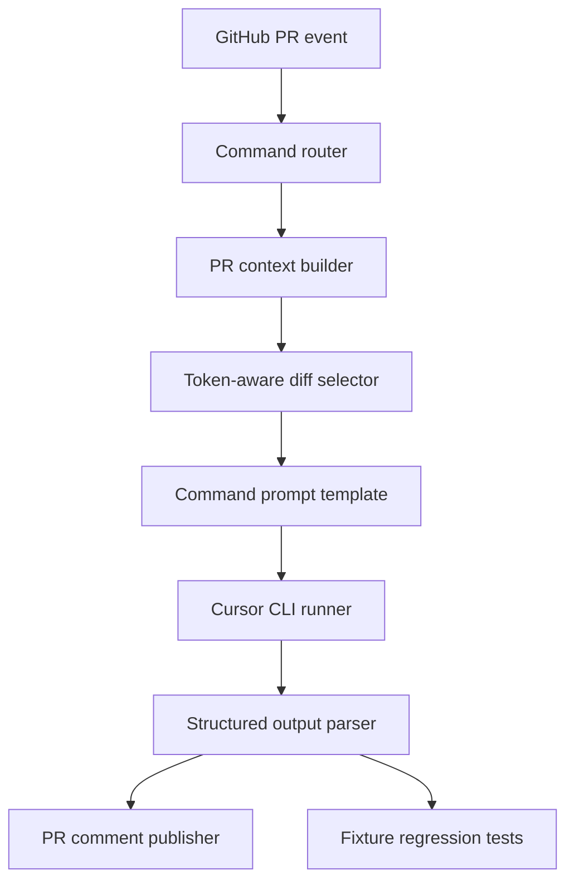

# Cursor-Native PR Agent Engine 计划

## 结论

走 **clean-room rebuild**：不 fork、不复制 PR-Agent 代码，避免 AGPL 代码复用风险；但吸收它的核心工程分层，把现有 `cursor-review-action` 升级为 **PR-Agent 产品形态 + Cursor CLI 执行层**。

当前核心入口在 `[scripts/cursor_review.py](c:\Users\nanyang2\OneDrive - Advanced Micro Devices Inc\桌面\cursor-review-action\scripts\cursor_review.py)`，现在是一条单文件 pipeline：读配置、解析命令、取 diff、拼 prompt、调用 `agent -p`、渲染 comment。下一步要拆成 engine 层。

核心能力拆解已沉淀到 `[PR_AGENT_ENGINE_MAPPING.md](c:\Users\nanyang2\OneDrive - Advanced Micro Devices Inc\桌面\cursor-review-action\PR_AGENT_ENGINE_MAPPING.md)`。后续实现应以这份 mapping 为准，确保 PR-Agent 的核心能力被逐层转译到 Cursor-native engine 中，而不是只复制命令名。

重要约束：该文档不能承诺“完美复用 PR-Agent”。它改为用 **behavioral parity**、**P0/P1/P2 parity levels**、**evidence gates** 和 **fixture regression** 来逼近功能等价。任何能力没有文档证据、clean-room 设计、fixture 覆盖、回归断言和 runtime diagnostics，都不能标记为完成。

## 目标架构

## Build vs Reuse

- **Build**：命令路由、上下文构造、diff selection、prompt templates、schema parser、comment renderer、fixture regression。这些放在我们自己的 action 中实现。
- **Reuse ideas only**：参考 PR-Agent 的分层思想、命令语义、配置优先级、diff compression、persistent comment、structured output，但不复制代码。
- **Keep**：`[action.yml](c:\Users\nanyang2\OneDrive - Advanced Micro Devices Inc\桌面\cursor-review-action\action.yml)` 作为 composite action 对外接口，底层仍调用 Cursor CLI。
- **Avoid for now**：GitHub App、服务端 webhook、多平台支持、自动修复、复杂 inline comment 定位。

## Mapping 结论

第一轮 core engine mapping 将 PR-Agent 精髓拆成七层，并为每层建立 parity level 与验证 checklist：

- **Command Semantics**：review/ask/improve/describe 是不同工具，不只是不同命令名。
- **Context Construction**：title/body/commit messages/files/diff/comment/config 都应进入结构化上下文。
- **Diff Selection**：大 PR 不能只截断，要有选择、压缩、覆盖范围说明。
- **Prompt Templates**：每个命令需要独立模板和独立输出契约。
- **Structured Output**：每个命令有 JSON schema，解析失败要 retry 或降级。
- **Publisher Strategy**：不同命令使用不同 persistent marker，避免互相覆盖。
- **Quality Harness**：用 fixture PR 测 context/diff/prompt/parser/render，不依赖 Cursor API。
- **Stability Gates**：用 release gates、failure matrix、config schema、diagnostics、security model 和 dogfooding loop 控制稳定性。
- **Execution Stability**：runner contract、online command args、run idempotency、budget controls 和 PR-Agent comparison protocol 是本轮新增稳定性要求。
- **Productization Controls**：traceability scorecard、prompt governance、privacy/logging、dependency and supply-chain controls 是本轮新增发布质量要求。
- **Output Quality Controls**：finding taxonomy、noise control、repo guidance、incremental scope、help/discoverability、schema evolution 是本轮新增用户体验与长期兼容要求。
- **Implementation Readiness Controls**：review lifecycle、metadata cache、non-goals、fixture inventory 是本轮新增的进入实现前约束。
- **Evidence Grounding Controls**：diff line index、anchor validation、invalid-anchor downgrade、finding dedup 是本轮新增的可审计 review 约束。
- **Trigger Trust Controls**：GitHub event、actor、author association、fork PR、`pull_request_target` 策略是本轮新增的安全触发约束。
- **Output Quality Gate Controls**：把 PR-Agent self-reflection 思路转成 deterministic publish decision，而不是过早引入多调用 critique。

## 执行门槛

实现前必须先满足 Phase 0：

- P0 capability 都有实现落点和 fixture 计划。
- P1 capability 如不立即实现，必须有明确 deferral reason。
- Out-of-scope capability 必须写清楚不做原因。
- README 不能暗示已经完全等价 PR-Agent。
- 后续代码实现必须能追溯到 `[PR_AGENT_ENGINE_MAPPING.md](c:\Users\nanyang2\OneDrive - Advanced Micro Devices Inc\桌面\cursor-review-action\PR_AGENT_ENGINE_MAPPING.md)` 中的 capability。
- 任何 release 必须通过对应 release gate，不能仅凭“功能已写完”发布。
- 稳定 API 必须遵守 compatibility contract；experimental 功能必须明确标记。
- 所有 GitHub Actions 常见失败必须有可见 diagnostics 或 README troubleshooting。
- Cursor CLI 调用必须经过 runner contract，不能散落在 command/prompt/diff 层。
- Slash command 参数必须是 allowlist parser，不能让用户输入进入 shell。
- 大 PR 行为必须受预算控制，并明确显示 reviewed/skipped coverage。
- PR-Agent 对比只能作为行为差距评估，不能复制输出文本作为 golden truth。
- P0 能力必须能从 capability ID 追踪到实现 PR、fixture、diagnostics 和 release notes。
- Prompt 变更必须当成产品行为变更处理，需要版本、fixture 或 dogfooding 记录。
- 默认日志与 PR comment 不能泄露 raw prompt、raw diff 或 token-like 字符串。
- 稳定 release 必须完成 release checklist，示例不能长期依赖 `@main`。
- `/cursor-describe` 默认只发 comment；PR body update 是 P1 opt-in，需先实现 user-content preservation marker。
- Model fallback 必须显式配置，不能静默 fallback。
- Inline comments 不进入 P0/P1，先设计 reporter contract，P2 再实现。
- Slash command args 使用小型 allowlist parser。
- Cursor CLI 单次调用默认 timeout 为 600 秒，可配置。
- Stale-run P0 只做 diagnostics，P1 再通过 GitHub API 检测。
- 每次运行必须有最终 lifecycle state diagnostics，至少区分 `published`、`failed`、`partial`。
- Metadata cache 默认不作为 P0 依赖；任何复用都必须按 head sha 校验。
- v1 前不做 GitHub App、多平台、auto-fix、完整 inline suggestion、ticket integration。
- fixture inventory 必须先定义，再实现 P0 parity claims。
- Actionable finding 必须先通过 selected diff anchor validation，才能作为精确 file/line finding 展示。
- Invalid anchor 只能进入 diagnostics 或降级输出，不能作为 high-confidence finding 或 CI gating 依据。
- `max_findings`、渲染和 CI gating 前必须先做 same-run dedup。
- Trigger trust 必须在 context construction 和 Cursor call 前判断。
- issue_comment slash command 默认只允许 trusted author association。
- fork PR 无 secret 时必须 skip 或 safe dry-run explain。
- 默认 workflow/example 不使用 `pull_request_target`。
- Render/publish 前必须执行 deterministic output quality gate。
- Model self-check 字段只能作为 advisory，不能替代本地 quality gate。
- second Cursor critique call 和 multi-model consensus 延后到 P2。
- 当前所有未决问题已收敛为默认实现决策；后续只有 fixtures、dogfooding 或用户反馈提供新证据时才重新打开。
- Progress comment 为 P1 `auto`，仅面向长耗时或 large/partial review；P0 只要求最终 lifecycle diagnostics。
- Metadata cache P1 使用 hidden comment marker；GitHub artifact/cache 是 P2 private-repo opt-in。
- `v0.5` 需要 10 个高风险 concrete fixtures；`v1` 目标 20 个 concrete fixtures。
- `file_only` findings 进入“Needs human verification”，不作为主 review finding。
- deleted-only evidence 使用 optional `old_line`/`line_side`，inline publishing 仍是 P2。
- 默认 trusted author associations 为 `OWNER`、`MEMBER`、`COLLABORATOR`；`CONTRIBUTOR` 需显式配置。
- untrusted slash command 默认不发公开拒绝评论，只写 Actions summary diagnostics。
- partial review 必须用醒目的 degraded heading 和 coverage warning。
- quality gate 结果进入 `findings-json` 和 Actions summary。

## 分层改造

1. **Command Layer**
   - 支持 `/cursor-review`、`/cursor-ask`、`/cursor-improve`、`/cursor-describe`。
   - 每个 command 有独立语义、prompt template、output schema 和 comment title。
   - 默认只启用 review，其余通过 config 开启。

2. **Context Builder**
   - 不只用 `git diff`。
   - 增加 PR title、body、commit messages、changed files、diff stat、comment prompt、existing bot comment。
   - wrapper workflow 负责传入 GitHub event metadata；engine 负责归一化。

3. **Diff Selector**
   - 替代粗暴 `max_diff_bytes` 截断。
   - 优先保留新增行、文件路径、hunk header、测试文件、配置文件、安全敏感文件。
   - 大 PR 时输出 reviewed/skipped files，让模型和用户都知道覆盖范围。

4. **Prompt Template System**
   - 从当前 `command_instructions()` 拆成模板文件或模板模块。
   - `review`：bug/security/tests/risk findings。
   - `ask`：只回答用户问题，引用 diff evidence。
   - `improve`：给优先级建议，不重复 review findings。
   - `describe`：生成 summary/risk/test plan/changelog style。

5. **Structured Output Parser**
   - 每个 command 定义 JSON schema。
   - findings 字段至少包含 `severity`、`file`、`line`、`title`、`body`、`confidence`、`suggestion`、`evidence`。
   - 解析失败时自动 retry 一次；仍失败则降级 markdown，并在 diagnostics 里标记。

6. **Publisher Strategy**
   - 保留 persistent summary comment。
   - 为不同 command 使用不同 marker，避免 `/cursor-review` 覆盖 `/cursor-ask`。
   - 发布前接收 quality gate 的 publish decision，不直接发布 raw parsed output。
   - 后续再引入 inline comments / annotations。

7. **Quality Harness**
   - 建 `fixtures/`：保存 PR metadata、diff、comment prompt、expected shape。
   - 建 regression runner：本地不一定调用 Cursor，可先验证 context/diff/prompt/parser/render。
   - 准备 10-20 个 fixture PR，覆盖文档变更、小代码变更、大 diff、配置变更、安全敏感变更。

8. **Execution Stability Layer**
   - 建立 Cursor runner contract，统一处理 Cursor CLI install/auth/model/runtime/output failure。
   - 加入 slash command 参数解析，但只支持 allowlist 参数。
   - 增加 run metadata、stale-run diagnostics、command-specific marker 和幂等更新策略。
   - 增加 max files/hunks/calls/timeout 预算控制，避免大 PR 或重试导致成本不可控。

8.5. **Trigger Trust Layer**
   - 在 context builder 和 Cursor runner 之前判断 event/actor/author association/fork/secrets 状态。
   - 对 untrusted trigger 直接 skip 或 safe dry-run explain。
   - 把 trigger decision 写入 diagnostics，避免用户误以为 bot 没响应。
   - 默认不使用 `pull_request_target`。

9. **Productization Layer**
   - 建立 capability ID 与 parity scorecard，连接 mapping、实现、fixture 和 release notes。
   - 将 prompt templates 版本化，所有 prompt 改动必须说明影响并更新 fixture 或 dogfooding notes。
   - 明确 privacy/logging policy：哪些数据进 Cursor、Actions log、PR comment，默认不输出 raw prompt/diff。
   - 建立 dependency and supply-chain checklist，稳定 release 使用 tag 而不是 `@main`。

10. **Resolved Defaults**
   - `/cursor-describe` v1 comment-only，避免覆盖人写的 PR body。
   - `fallback_models` 默认为空，模型失败时诊断而不是静默换模型。
   - `timeout_seconds` 默认 600。
   - `max_cursor_calls` 默认 1，多调用必须 opt-in。
   - detailed parity scorecard v1 前只放 maintainer docs，v1 后再公开 summary。
   - release checklist 放 `docs/release-checklist.md`，README 只放用户上手路径。
   - 默认 review full selected PR diff；incremental review 只有 run-state 可靠后才 opt-in。
   - 所有 finding 必须有 taxonomy、severity、confidence 和 schema_version。
   - Repo guidance 必须有大小预算和 diagnostics，不能无限注入。
   - Help command 不调用 Cursor，只展示启用命令和 troubleshooting。
   - style/readability/refactor 默认属于 `/cursor-improve`，不进入 `/cursor-review` 噪音路径。
   - `.cursor-review.yml` 是唯一必需配置；`.cursor-review-instructions.md` 和 `best_practices.md` 都是 P1 可选 guidance。
   - incremental review 首先使用 persistent comment metadata，GitHub check-run metadata 延后评估。
   - 同时支持 `/cursor-help` 和 `/cursor-review help`，两者走静态 help renderer。
   - schema migration 先文档化，只有真实用户需要时再自动化。

11. **Human Workflow Defaults**
   - AI review 默认 advisory/non-blocking，不自动 approve，不自动 merge。
   - `fail-on-findings` 保持 experimental，必须显式设置 severity threshold。
   - 本地 no-Cursor dry-run 是 P0，确保贡献者无 secret 也能验证 engine 行为。
   - `language` 只影响人类可读输出，JSON schema 和 diagnostics keys 保持稳定。
   - dogfooding 必须使用 human acceptance rubric 记录误报、漏报、证据质量和可用性。

12. **Implementation Readiness Defaults**
   - 生命周期状态进入 diagnostics，避免用户看到沉默失败或不可解释的 partial review。
   - 进度评论是 P1，不阻塞 first engine split。
   - describe metadata 复用是 P1，缺失或过期时必须安全降级到无缓存重建。
   - non-goals 必须先写进 docs，后续 feature request 先分类 P0/P1/P2/out-of-scope。
   - fixture inventory 要覆盖正例、反例、失败路径和 GitHub Actions 权限路径。

13. **Evidence Grounding Defaults**
   - diff selector 产物必须能生成 selected-diff line index。
   - parsed findings 使用 `anchored`、`file_only`、`unanchored`、`invalid` 四类 grounding status。
   - summary comment 也必须做 grounding validation；inline comment 是 P2，不是 grounding 的前置条件。
   - same-run findings 先 normalization/fingerprint/dedup，再按 severity、confidence、grounding、actionability 排序。
   - CI gating 不计算 invalid anchors 和 duplicate findings。

14. **Trigger Trust Defaults**
   - `pull_request` same-repo 可以自动 review，前提是 secrets 可用。
   - fork PR 没有 secrets 时必须 skip 或 safe dry-run explain。
   - `issue_comment` command 默认要求 trusted author association。
   - `workflow_dispatch` 记录 actor 和 trigger diagnostics。
   - `pull_request_target` 不进入默认示例；如果未来支持，必须作为 advanced mode 单独写安全文档。

15. **Output Quality Gate Defaults**
   - parser、grounding、taxonomy、dedup、redaction、coverage 和 command policy 汇总到统一 publish decision。
   - P0 publish decision 包括 `publish`、`publish_partial`、`publish_with_diagnostics`、`suppress_findings`、`fail_before_publish`。
   - unsupported claims 默认降级，尤其是未执行测试、未验证安全、未测性能却声称已确认的内容。
   - redaction failure 阻止 raw comment publishing。
   - 自我检查先作为 deterministic gate，不先做第二次 Cursor critique。

16. **Resolved Open Questions Defaults**
   - Progress comment：P1 `auto`，只对预计超过 90 秒或 large/partial review 显示；普通 P0 run 不发进度评论。
   - Metadata cache：P1 hidden persistent comment marker；P2 private-repo artifact/cache opt-in。
   - Fixture minimum：`v0.5` 至少 10 个 concrete fixtures，`v1` 目标 20 个。
   - `file_only` findings：单独放入“Needs human verification”区，不进入主 review 或默认 CI gating。
   - Deleted-line evidence：支持 optional `old_line` 和 `line_side`，但不提前实现 inline deleted-line comments。
   - Dedup fingerprint：使用 normalized path、taxonomy、line side、anchor/hunk signature、normalized title、evidence hash；不包含 prompt version。
   - Trigger trust：默认信任 `OWNER`、`MEMBER`、`COLLABORATOR`，不默认信任 `CONTRIBUTOR`。
   - Untrusted slash command：默认不公开回复，避免评论噪音；Actions summary 必须记录 skip reason。
   - Public/private trigger policy：P0 使用同一安全默认；private repo 放宽必须显式配置。
   - Partial review：内部可用 `publish_with_diagnostics`，外部必须显示 `Partial Cursor Review` 或等价醒目标题。
   - Unsupported claims：P0 覆盖测试执行、安全验证、性能结论、部署/运行时确认、外部 issue/ticket/customer 状态。
   - Quality gate output：机器可读结果进入 `findings-json`，人类可读摘要进入 Actions summary，PR comment 放 compact diagnostics。

## 文件落点

建议从单文件拆成：

- `[scripts/cursor_review.py](c:\Users\nanyang2\OneDrive - Advanced Micro Devices Inc\桌面\cursor-review-action\scripts\cursor_review.py)`：保留为 CLI entrypoint，逐步变薄。
- `scripts/engine/commands.py`：命令解析和 command registry。
- `scripts/engine/config.py`：配置加载和优先级。
- `scripts/engine/context.py`：PR metadata 与 git context 构造。
- `scripts/engine/diff_selector.py`：diff 选择、压缩、截断说明。
- `scripts/engine/prompts/`：四个命令的 prompt 模板。
- `scripts/engine/runner.py`：Cursor CLI 调用和 retry。
- `scripts/engine/parser.py`：JSON schema 解析和降级。
- `scripts/engine/render.py`：Markdown comment 渲染。
- `tests/fixtures/`：fixture PR 输入。
- `tests/test_engine.py`：不依赖 Cursor API 的单元/回归测试。
- `docs/parity-scorecard.md`：capability ID、P0/P1/P2 状态、fixture 和 release gate 追踪。
- `docs/prompt-governance.md`：prompt 版本、变更 checklist、质量指标。
- `docs/finding-taxonomy.md`：finding 类型、severity、confidence、noise-control。
- `docs/repo-guidance.md`：repo guidance 文件、大小预算、注入规则。
- `docs/config-migration.md`：config/schema 演进和迁移说明。
- `docs/human-review-workflow.md`：人工 review 使用方式、override、acknowledgement。
- `docs/ci-policy.md`：CI status、fail-on-error、fail-on-findings 策略。
- `docs/local-development.md`：本地 dry-run 和测试说明。
- `docs/localization.md`：语言与稳定 schema/diagnostics 边界。
- `docs/acceptance-rubric.md`：人工验收和 dogfooding rubric。
- `docs/privacy-and-logging.md`：数据边界、debug mode、secret redaction。
- `docs/release-checklist.md`：发布、依赖、tag、dogfooding checklist。
- `docs/review-lifecycle.md`：运行状态、partial/failure 语义、progress comment 策略。
- `docs/metadata-cache.md`：describe metadata 复用、head sha 校验、失效规则。
- `docs/non-goals.md`：v1 前不做能力和延后原因。
- `tests/fixtures/README.md`：fixture inventory、capability IDs、正反案例目录规范。
- `scripts/engine/redaction.py`：日志和评论的 token-like string redaction。
- `scripts/engine/lifecycle.py`：生命周期状态与 diagnostics。
- `scripts/engine/metadata_cache.py`：可选 metadata cache 读写与校验。
- `scripts/engine/diff_index.py`：从 selected diff 生成 file/hunk/line 索引。
- `scripts/engine/grounding.py`：验证 finding 的 file/line/evidence anchor 并生成 grounding status。
- `scripts/engine/findings.py`：finding normalization、fingerprint、dedup、排序和 suppression。
- `docs/finding-grounding.md`：anchor validation、invalid-anchor downgrade、deleted-only diff 规则。
- `scripts/engine/trust_policy.py`：trigger eligibility、trust level、skip reason、author association gating。
- `docs/trigger-policy.md`：GitHub event、fork PR、issue_comment、workflow_dispatch、pull_request_target 策略。
- `tests/fixtures/triggers/`：trusted/untrusted/fork/non-PR issue_comment/rerun trigger fixtures。
- `scripts/engine/quality_gate.py`：汇总 schema、grounding、dedup、redaction、unsupported-claim 检查并产出 publish decision。
- `docs/output-quality-gate.md`：发布决策、self-check 边界、unsupported-claim downgrade 规则。
- `tests/fixtures/quality_gate/`：suppress、partial publish、redaction block、unsupported-claim downgrade fixtures。

## 验收标准

- `/cursor-review` 输出质量不低于当前版本，且 diagnostics 更完整。
- `/cursor-review + 用户 prompt` 明确影响分析重点。
- `/cursor-ask`、`/cursor-improve`、`/cursor-describe` 有独立模板和 schema，但可默认关闭。
- 大 diff 不再只是截断，而是说明 reviewed/skipped files。
- parser 能处理结构化输出，失败时 retry 一次并可降级。
- fixture regression 能在不消耗 Cursor API 的情况下验证 context、diff selection、prompt、render 不退化。
- P0 能力有 parity scorecard 记录，并能追踪到 fixture。
- Prompt templates 有版本和变更治理规则。
- Findings 有 taxonomy、severity、confidence 和 `schema_version`。
- Repo guidance 有预算、诊断和安全边界。
- Incremental review 默认关闭，不会漏看 full PR selected diff。
- AI review 默认 advisory/non-blocking，不会自动 approve 或 merge。
- Local dry-run 不需要 `CURSOR_API_KEY`。
- `language` 不改变 JSON schema keys 或 diagnostics keys。
- Dogfooding 有人工验收 rubric 记录。
- Diagnostics 有 redaction，不泄露 secret 或 token-like strings。
- Diagnostics 显示 lifecycle state，并明确 partial review reason。
- Metadata cache 缺失、过期或被禁用时不会导致命令失败。
- `docs/non-goals.md` 明确 v1 前不做的 PR-Agent 周边能力。
- Fixture inventory 覆盖核心正反案例，并能追踪到 capability IDs。
- Anchored findings 能被 selected diff line index 验证。
- Invalid anchors 不作为 high-confidence finding 或 CI gating 依据。
- Duplicate findings 不会挤占 `max_findings` 名额。
- Untrusted trigger 不会调用 Cursor。
- Fork PR 缺少 secrets 时有可见 skip/explain diagnostics。
- issue_comment command 默认受 author association gate 保护。
- 默认示例不依赖 `pull_request_target`。
- Output quality gate 对每次 render/publish 产出 publish decision。
- Unsupported claims 不会作为高置信 review finding 发布。
- Redaction failure 会阻止 raw comment publishing。
- 当前未决问题全部已有默认决策，且记录在 `PR_AGENT_ENGINE_MAPPING.md` 的 `Resolved Open Questions` 与 Round K。
- `v0.5` fixture gate 明确为 10 个 concrete fixtures，`v1` 目标为 20 个。
- `file_only`、deleted-only、partial review、untrusted command、quality gate output 都有默认渲染/诊断策略。
- Release checklist 通过后才能打稳定 tag。
- README 明确说明这是 clean-room Cursor-native PR Agent，不复制 PR-Agent 代码。

## 本轮新增结论

- 当前计划没有遗漏最核心的 PR-Agent engine 层；本轮主要是把此前所有未决问题根据 PR-Agent 产品行为边界收敛为默认决策。
- 这些新增内容不改变底层执行器选择：仍使用 Cursor CLI / Cursor Agent；也不引入 PR-Agent 源码、prompt、schema 或测试。
- 解决策略遵循同一个原则：P0 保守、可诊断、少噪音；P1 提供显式 opt-in；P2 延后高复杂度服务化能力。
- 后续不应继续保留模糊未决问题；只有 fixtures、dogfooding 或用户反馈给出反证时才重新打开。

## 本轮已解决未决问题

- Progress comment：P1 `auto`，只对长耗时或 large/partial review 显示。
- Metadata cache：P1 hidden comment marker；P2 private artifact/cache opt-in。
- Fixture minimum：`v0.5` 10 个 concrete fixtures；`v1` 20 个目标。
- `file_only` findings：进入“Needs human verification”区。
- Deleted-only findings：支持 optional `old_line`/`line_side`，inline 仍是 P2。
- Dedup fingerprint：使用稳定语义字段，不包含 prompt version。
- Trusted author associations：默认 `OWNER`、`MEMBER`、`COLLABORATOR`。
- Untrusted slash command：默认不公开回复，只写 Actions summary。
- Public/private policy：P0 同一安全默认，private 放宽必须显式配置。
- Partial review：使用醒目 degraded heading 和 coverage warning。
- Unsupported claims：P0 覆盖测试、安全、性能、部署/运行时、外部 issue/ticket/customer 状态。
- Quality gate output：进入 `findings-json` 和 Actions summary，PR comment 放 compact diagnostics。

## 当前重新打开条件

- None for the current planning layer.
- 新问题只能基于 implementation、fixture regression、dogfooding 或真实用户反馈重新打开。